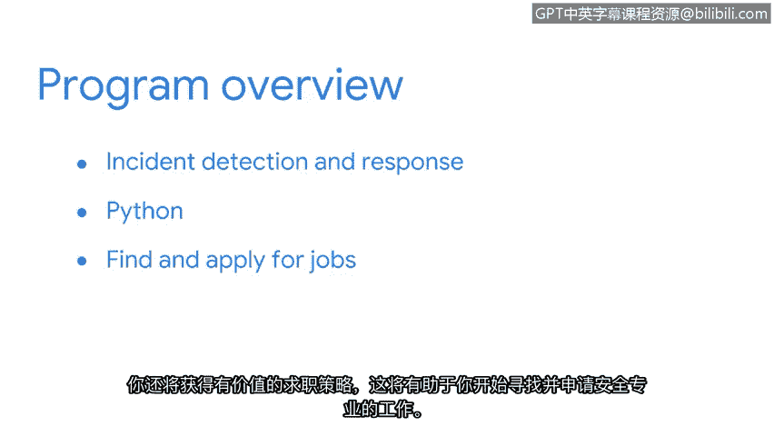

# 001：欢迎参加谷歌网络安全证书课程 🎉

在本节课中，我们将要学习谷歌网络安全专业证书课程的总体介绍，包括课程目标、行业前景、你将学到的核心技能以及教学团队的构成。

欢迎参加谷歌网络安全专业证书课程。我是托尼，谷歌的安全工程经理，也是本证书项目第一门课程的讲师。你已经开始学习这门课程，这标志着你在构建新技能、助力职业发展的道路上迈出了重要一步。

网络安全起初可能令人望而生畏，但你会惊讶地发现，我们许多人都有不同的专业背景。在进入安全行业之前，我曾是一名情报分析师。我很高兴能作为你的讲师，陪伴你开启安全领域的旅程。

## 网络安全行业前景 📈

上一节我们介绍了课程的启动，本节中我们来看看网络安全行业的巨大需求。

对安全专业人员的需求正以惊人的速度增长。到2030年，美国劳工统计局预计安全相关职位的增长将超过30%，远高于其他职业的平均增长率。

全球互联网接入正在普及。每天都有更多的人和组织采用新的数字技术。拥有一支背景、视角和经验多元化的安全专业人员社区，对于保护和服务不同的市场至关重要。

## 安全工作的意义与多样性 🌍

安全工作的主要目标是保护组织和人员。这份工作让你能够支持并与全球各地的人们互动。

以下是安全行业的一些特点：
*   初级安全分析师职位有很多空缺，雇主们难以找到具备合适专业知识的足够候选人。
*   无论你当前的技能水平如何，完成本证书项目后，你都将为找到安全相关的工作或在安全领域拓展职业生涯做好准备。

## 安全分析师做什么？🔍

你可能想知道，安全专业人员到底做什么？

如果你曾经在线更新密码，要求包含数字或特殊符号，那么你已经熟悉了密码管理等基本安全措施。如果你曾收到服务提供商关于数据被盗或软件被黑的通知，那么你对安全漏洞的影响就有了第一手经验。如果你曾问过自己组织如何保护数据，那么你已经具备了在这个行业取得成功所需的两项重要特质：好奇心和兴奋感。

安全分析师帮助最小化组织和人员面临的风险。他们主动防范安全事件，同时持续监控系统和网络。如果事件发生，他们会进行调查并报告发现。他们总是在提问并寻找解决方案。

## 通往安全职业的路径 🛤️

安全行业最棒的一点在于它为你提供了许多路径和职业选择。每个选择都涉及一套独特的技能和责任。无论你的背景如何，你可能会发现自己已经拥有一些相关经验。

如果你喜欢与他人合作、帮助他人、解决难题并且乐于接受挑战，那么这个职业适合你。例如，我作为情报分析师的背景与网络安全毫无关系。然而，当我决定从事安全职业时，强大的批判性思维和沟通技巧为我的成功奠定了坚实的基础。

如果你不确定想在安全行业选择哪个方向，这没关系。本课程将概述许多不同类型的可用工作。它还将让你探索某些专业技能组合，帮助你确定职业发展方向。

## 课程设计与内容概览 📚

谷歌职业证书由谷歌拥有数十年经验的行业专业人士设计。在每门课程和整个证书项目中，都将有不同的谷歌专家指导你。

我们将通过视频分享知识，通过实践活动提供练习机会，并带你了解工作中可能遇到的真实场景。在整个项目中，你将通过实践练习来检测和响应攻击、监控和保护网络、调查事件以及编写代码来自动化任务。

该课程由多门课程组成，旨在帮助你获得入门级工作。你将学习以下主题：
*   **核心安全概念**与**安全领域**
*   **网络安全**
*   **计算基础**，包括 **Linux** 和 **SQL**
*   理解**资产**、**威胁**和**漏洞**

我们的目标是帮助你实现加入安全行业的目标。你还将学习事件检测和响应，以及如何使用 **Python** 等编程语言来完成常见的安全任务。此外，你还将获得宝贵的求职策略，这些策略在你开始寻找和申请安全职业的工作时将使你受益。

## 证书价值与灵活性 💼

完成这个谷歌职业证书将帮助你培养技能，并学习如何使用工具，为你在一个快速成长、高需求的领域找到工作做好准备。如果你以兼职方式学习，该证书旨在让你在3到6个月内为工作做好准备。一旦毕业，你可以与超过200家有兴趣雇佣像你这样的谷歌职业证书毕业生的雇主建立联系。

无论你是想换工作、开始新的职业生涯，还是提升技能，这个谷歌职业证书都可以为你打开新工作机会的大门。你不需要具备安全领域的先验经验或知识，因为本证书项目将从基础知识开始。我将在整个第一门课程中陪伴你，确保你学到在该领域取得成功所需的基础知识。

这个项目也很灵活。你可以按照自己的方式和节奏在线完成本证书的所有课程。

## 教学团队介绍 👥

我们召集了一些优秀的讲师来支持你的学习之旅，他们现在想介绍一下自己。

以下是本项目的讲师团队：
*   **阿什莉**：谷歌安全运营销售客户工程赋能负责人。将带你学习安全领域、框架和控制措施，以及常见的安全威胁、风险和漏洞。你还将了解安全分析师常用的工具。
*   **克里斯**：谷歌光纤的首席信息安全官。将与你探讨网络结构、网络协议、常见网络攻击以及如何保护网络。
*   **金**：谷歌的技术项目经理。将指导你学习支持安全分析师工作的基础计算技能，我们还将学习操作系统、**Linux命令行**和 **SQL**。
*   **塞奎亚**：谷歌的安全工程师。我们将一起探索通过各种安全控制措施保护组织资产，并更深入地理解风险和漏洞。
*   **戴夫**：谷歌的首席安全战略师。在我们共同学习的时间里，我们将学习检测和响应安全事件，你还有机会使用强大的安全工具监控和分析网络活动。
*   **安希**：谷歌的安全工程师。我们将探索基础的 **Python** 编程概念，帮助你自动化常见的安全任务。
*   **迪翁**：谷歌的项目经理。我是本项目最后一门课程前半部分的讲师。在那里，我们将讨论如何升级事件处理并与利益相关者沟通。
*   **艾米丽**：谷歌的项目经理。我将指导你完成项目的最后部分，并分享你如何参与安全社区并为即将到来的求职做准备。

正如你已经知道的，我将指导你完成本项目的第一门课程。

现在是你在安全领域发展职业生涯的大好时机。听起来很令人兴奋，让我们开始吧。

---

本节课中我们一起学习了谷歌网络安全证书课程的概况，了解了网络安全行业的广阔前景、安全分析师的角色、课程的灵活设计与丰富内容，以及强大的教学团队。这为你后续的系统学习奠定了坚实的基础。