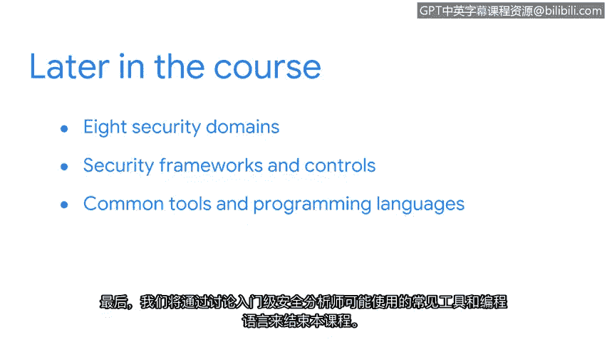

# 002：欢迎来到第一周

## 概述

在本节课中，我们将介绍整个课程的学习目标与内容结构。你将了解信息安全的基础概念、安全分析师的角色与技能，以及本课程将涵盖的核心知识领域。

## 课程内容导览

现在你已经对整个专业证书项目有了初步了解，接下来我们详细讨论你将在本课程中学到的具体内容。

本课程将引领你进入信息安全的世界，并展示如何运用安全知识来保护企业运营、用户和设备。你的学习将有助于为所有人创造一个更安全的互联网环境。

## 第一模块：基础安全概念

在课程的第一部分，我们将涵盖信息安全的基础概念。

以下是本模块的核心学习路径：

1.  **定义安全**：首先，我们将明确“安全”在信息技术领域的定义。
2.  **安全分析师职责**：接着，我们将探讨安全分析师的常见工作职责。
3.  **核心技能**：在此基础上，我们将介绍安全分析师应具备的核心技能。
4.  **安全的价值**：最后，我们将讨论安全对于保护组织和个人的重要性。

## 后续模块预览

在掌握了基础概念后，我们将深入更具体的知识领域。

上一节我们介绍了安全的基础，接下来我们来看看更系统的知识体系。以下是后续模块的主要内容：

1.  **八大安全域**：我们将涵盖信息安全的八个主要领域。
2.  **安全框架与控制**：然后，我们将学习常用的安全框架和控制措施。
3.  **工具与语言**：最后，课程将总结入门级安全分析师可能使用的常见工具和编程语言。

## 学习资源与开始

接下来，我们将介绍一些学习资源，帮助你从本项目中获得最大收益。

我们非常期待你开启这段学习旅程。现在，让我们开始吧。😊

## 总结

本节课中，我们一起学习了本课程的整体框架和学习目标。我们概述了从基础安全概念到具体工具使用的学习路径，为后续深入各个安全主题打下了基础。