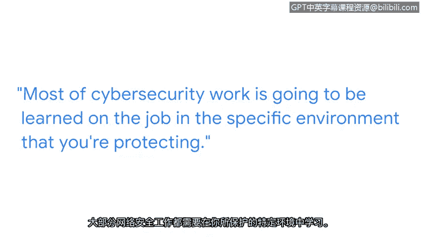

# 004：我在网络安全领域的道路

## 概述
在本节中，我们将跟随托尼的分享，了解他从国际关系领域转向网络安全行业的个人经历与心路历程。这段经历将帮助我们理解网络安全职业道路的多样性以及持续学习的重要性。

大家好，我是托尼，现任安全工程经理。我的团队负责保护谷歌及其用户免受严重威胁的侵害，这些威胁通常来自政府支持的攻击者、有组织的舆论影响行动以及严重的网络犯罪威胁行为者。

我从小在军人家庭长大，父亲是军人，因此我们经常搬家。我一直对广义上的安全领域抱有浓厚兴趣。高中时期，我对国际关系产生了极大的热情，并参加了许多模拟联合国活动。这让我将世界范围内的安全运作方式与我的兴趣结合了起来。

我来自一个大家庭，深知自己需要经济援助才能上大学。美国国防部提供了许多与服役相关的教育机会，这对我来说是一个很自然的选择。我既对这个领域感兴趣，同时这也为我通往热爱的职业提供了一条路径。

## 职业起点与转型
上一节我们了解了托尼的背景和兴趣起源，本节中我们来看看他的职业起点以及关键的转型时刻。

我的职业生涯始于情报分析，但最初并非专注于网络安全。我从事了多年的反叛乱工作以及地缘政治情报分析。最终，当我观察到网络安全开始对我们的日常生活以及国际关系领域产生影响时，我越来越被这个领域所吸引。

对我来说，转型进入网络安全领域是一个巨大的转变。我进入这个领域时并没有扎实的技术背景，因此不得不在工作中以及通过不同类型的自学课程来学习大量知识。

## 关键学习内容与方法
在明确了转型方向后，托尼面临具体的学习挑战。以下是他在转型过程中需要掌握的核心技能和学习方法。

我需要学习编程语言，例如 **`Python`** 和 **`SQL`**，这些内容也包含在本证书课程中。我还需要学习一门全新的“语言”，即关于威胁的词汇、不同组成部分以及它们如何在技术上体现。

在这段旅程的早期，我必须弄清楚的一件事是：我属于哪种类型的学习者。我最适合结构化的学习方式，因此我转向了许多在线课程和资源，这些材料从基本原理到实际应用进行了结构化编排，这对我来说非常有效。

## 团队协作与持续学习
掌握了基础知识后，真正的成长往往发生在工作实践中。本节将探讨团队合作和持续学习在网络安全职业中的核心作用。

很多知识也是通过愿意分享并投入时间帮助我理解的同事们，在工作中学会的。我提出了很多问题，并且至今仍然如此。大部分的网络安全工作都需要在你所保护的具体环境中，通过工作实践来学习。

因此，你必须与团队成员良好合作，才能共同构建起知识库。

我的建议是：保持好奇心，坚持学习，尤其要专注于提升你的技术技能，并在整个职业生涯中不断精进。

## 克服挑战与心态调整
在快速发展的网络安全领域，从业者常会面临心态上的挑战。托尼将分享他如何应对这些挑战。

在网络安全领域，人们很容易产生“冒名顶替综合征”，因为这个领域太广阔了，精通所有这些不同的领域需要毕生的努力。有时，这种冒名顶替的感觉会让我们止步不前，让我们觉得“何必继续努力成长呢？我永远也无法掌握这一切”，而不是激励我们前进。

所以，请坚持学习，克服这种恐惧。你的努力终将获得回报。

## 总结
本节课中，我们一起学习了托尼从国际关系分析员转型为网络安全工程师经理的非传统职业路径。我们了解到，进入网络安全领域不一定需要计算机科班出身，但需要**保持好奇心**、**坚持结构化学习**（如学习 **`Python`** 等技能）、**善于在团队中提问和协作**，并**勇于克服“冒名顶替综合征”** 等心态挑战。这段经历证明，多元化的背景和持续学习的热情是网络安全职业成功的关键要素。