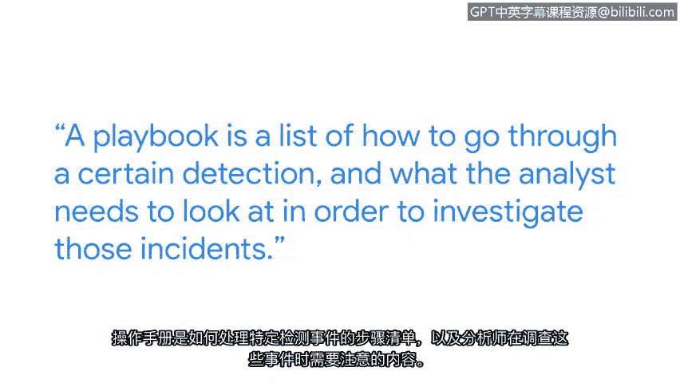

# 006：安全工程师的一天 👩💻

在本节课中，我们将跟随谷歌安全工程师尼基的分享，了解一名初级网络安全专业人员的日常工作、职责以及所需的技能。这有助于初学者建立对网络安全职业的直观认识。

我的名字是尼基，我是谷歌的一名安全工程师。我隶属于谷歌的内部威胁检测团队，因此我的角色更侧重于发现公司内部的内部威胁或可疑活动。

## 兴趣的起源 🔍

上一节我们认识了尼基的角色，本节中我们来看看她是如何对网络安全产生兴趣的。她对网络安全的初次体验是在一家水族馆实习时。她在那里学到了很多网络安全知识，当然，水族馆也面临许多网络钓鱼攻击尝试。她的经理非常注重确保我们的网络安全，我从他身上学到了很多，这真正激发了我对网络安全的兴趣。

## 选择网络安全职业的原因 🛤️

了解了兴趣的起源后，我们来看看尼基选择这条职业道路的核心原因。我选择从事网络安全职业的主要原因是其职业路径的灵活性。一旦进入安全领域，你可以深入许多不同的方向，无论是通过蓝队（保护用户）还是红队（即寻找他人防御的漏洞并告知他们问题所在）。

## 初级安全专业人员的一天 📅

在探讨了职业选择后，我们来具体看看初级安全专业人员典型的一天是怎样的。初级安全专业人员的一天可能日复一日地变化，但它基本包含两个部分。

以下是日常工作的两个基本组成部分：

*   **运营方面**：响应检测警报并进行调查。
*   **项目方面**：与其他团队合作构建新的检测机制或改进现有的检测机制。

## 分析师与工程师的区别 ⚙️

区分“网络安全分析师”和“网络安全工程师”的初级角色很重要。初级网络安全分析师和初级网络安全工程师之间的区别主要在于，分析师更侧重于运营工作，而工程师虽然也能进行运营，但他们还负责构建检测机制，并且从事更多以项目为中心的工作。

## 最喜爱的任务 🕵️♀️

明确了角色差异后，尼基分享了她工作中最喜欢的部分。我最喜欢的任务可能是运营方面的调查工作。因为我们有时会收到诸如“某个行为者在某天做了某事”这样的警报，然后我们需要深入调查他们一直在做什么、一直在处理什么，以确定是否存在任何可疑活动，或者是否只是误报。

## 创造影响力的方式 🌟

除了日常任务，初级安全人员也能通过其他方式为团队创造价值。作为初级网络安全专业人员，我产生最大影响的方式之一实际上是完善我们团队使用的操作手册。

一个**操作手册**是一个清单，列出了如何处理特定检测以及分析师需要查看哪些内容来进行调查。

我为自己目前制作的那些操作手册感到非常自豪，因为我的许多队友甚至都说过这些手册对他们有多么大的帮助。

## 适合的人群 ❤️

最后，基于以上所有经历，尼基总结了什么样的人可能适合这个角色。如果你热爱解决问题，如果你热爱保护用户数据，并且希望身处许多新闻头条事件的前线，那么这绝对是一个适合你的角色。

---

本节课中我们一起学习了安全工程师尼基的工作日常，了解了网络安全职业的多样性、初级岗位的职责分工（运营 vs. 项目），以及通过制作操作手册等方式创造价值。最重要的是，我们认识到解决问题和保护数据的热情是从事这一职业的关键动力。