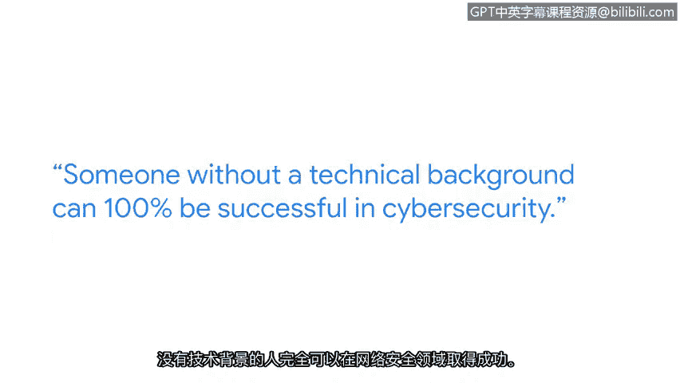

**谷歌网络安全专业证书课程：第一课：《信息安全基础》：P8：维罗妮卡的网络安全职业之路** 🛡️

---

### **概述**

在本节中，我们将跟随谷歌安全工程师维罗妮卡的分享，了解她非传统的网络安全职业发展路径。她的经历将帮助我们理解，即使没有技术背景或相关学位，也能成功进入并热爱这个领域。

---

大家好，我是维罗妮卡，是谷歌的一名安全工程师。

我的网络安全职业旅程极大地改善了我的生活。其中最重要的一点是，我从事着一份非常有成就感的工作。我能做自己非常热爱且超级感兴趣的事情，并感到非常幸运，这就是我的工作。

在我进入当前领域之前，我完全不了解网络安全是什么。我对网络安全的认知仅限于使用安全密码，仅此而已。所以，如果你在五年前问我是否会进入网络安全领域，我可能会反问：“那是什么？”

**没有技术背景的人，100%可以在网络安全领域取得成功。** 我通往当前网络安全角色的道路，始于在谷歌担任IT驻场工程师，负责技术支持。在那里，我学到了很多分析思维技能，通过故障排除和调试来帮助他人。直到进入我的网络安全角色，我才意识到自己拥有可迁移的技能。

从那时起，我主动去请教了许多安全工程师，并采访了他们中的很多人。我能走到今天并非独自一人，是一群导师的帮助让我走到了这里。所以，不要害怕寻求帮助。

**我认为进入网络安全领域并不一定需要大学学位。** 我有幸共事的一些最聪明的人就没有大学学位。我认为这是这个行业最好的特点之一。

回顾我的职业生涯，我希望我当时能明白：**我不需要满足所有条件**，也不需要成为某个领域的专家才去尝试。我也希望我当时能明白，**完美主义可能会阻碍你实现目标**。

---

### **总结**

本节课中，我们一起学习了维罗妮卡从非技术背景成功转型为谷歌安全工程师的经历。她的故事强调了几个关键点：**可迁移技能的重要性**、**积极寻求导师帮助的价值**，以及**进入网络安全领域不一定需要传统学位或成为专家**。最重要的是，要勇于尝试，不要让“准备不足”或“完美主义”成为行动的障碍。