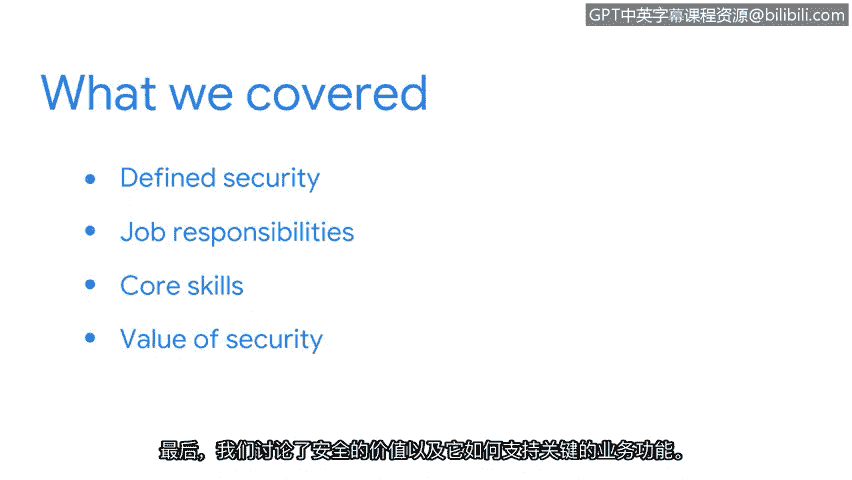

# 010：总结

在本节课中，我们共同完成了课程第一章节的学习。现在，让我们对已学内容进行回顾与总结。

上一节我们介绍了安全的价值及其对关键业务功能的支持。本节中，我们将快速回顾整个章节的核心要点，为后续学习奠定基础。

以下是我们在本章节中涵盖的主要内容：

*   **安全的定义与价值**：我们定义了安全，并介绍了在组织中实施安全措施所带来的益处。
*   **核心工作职责**：我们讨论了不同的工作职责，例如管理威胁和安装防护软件。
*   **关键核心技能**：我们介绍了一些重要的核心技能，例如团队协作和计算机取证。
*   **安全的重要性**：我们最后探讨了安全的价值，以及它如何支持关键业务功能。

希望你对信息安全有了更深入的理解。如果你觉得在继续前进前需要复习，可以随时返回并重温任何不确定的内容。

通过学习这些基础知识，你正在为整个网络安全职业生涯打下坚实的基础。接下来，我们将探索一些塑造了安全行业的著名攻击案例。

本节课中我们一起学习了信息安全的基本概念、职责、技能及其商业价值。我期待与你继续这段学习旅程。😊