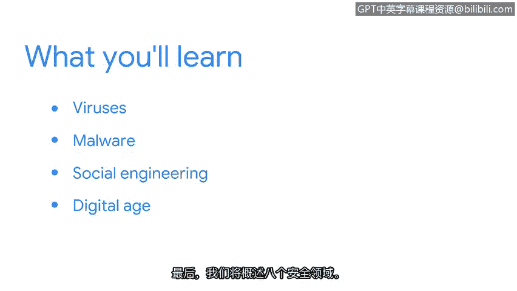
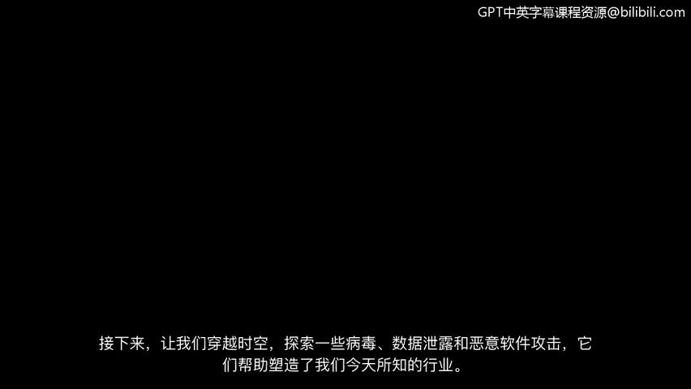

# 011：欢迎来到第二周

欢迎回来。在安全领域，有大量知识需要学习，我很荣幸能成为你职业旅程的一部分。

现在是学习安全知识的绝佳时机。

当我了解到影响私营公司和政府组织的国际黑客攻击时，我深受启发，立志投身安全领域，因为我认识到这个领域充满活力且至关重要。

如今安全领域存在如此多工作岗位的原因之一，可追溯到20世纪80年代和90年代发生的攻击。数十年后，安全专业人员仍在积极工作，以保护组织和人们免受这些早期计算机攻击变种的威胁。在本节课程中，我们将讨论病毒和恶意软件，并介绍社会工程的概念。

接下来，我们将探讨数字时代如何催生了新一代威胁行为者。

了解每种攻击的演变过程，是防范未来攻击的关键。最后，我们将概述八个安全领域。

上一节我们介绍了本周的学习目标。本节中，我们将回顾历史，探索一些病毒、数据泄露和恶意软件攻击，正是这些事件塑造了我们今天所知的行业。

