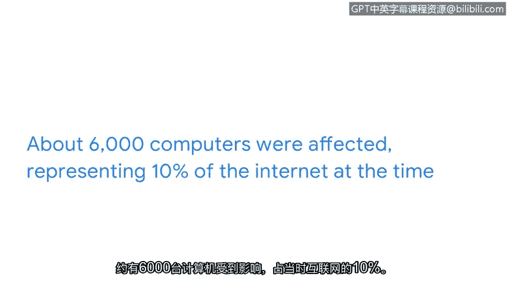
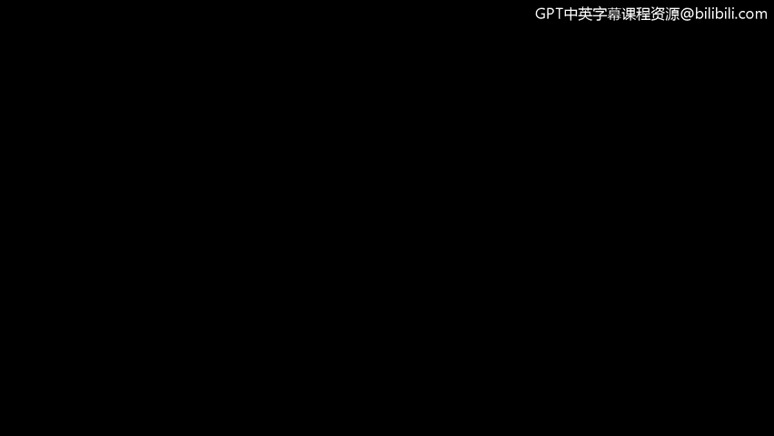

# 012：过去的网络安全攻击 🛡️

在本节课中，我们将学习历史上的网络安全攻击案例。理解这些过去的攻击方式，有助于我们认识当前安全威胁的演变，并为处理或调查安全事件提供方向。

## 关键术语定义

在深入探讨具体攻击之前，我们先明确两个核心概念。

**计算机病毒**是一种恶意代码，旨在干扰计算机操作并对数据和软件造成损害。病毒会附着在计算机上的程序或文档中，然后在网络中传播并感染一台或多台计算机。

**蠕虫**是计算机病毒的一种，它可以**自我复制和传播**，无需人为干预。如今，病毒更常被称为**恶意软件**，即设计用于危害设备或网络的软件。

## 早期恶意软件攻击案例

以下是两个早期的恶意软件攻击案例：Brain病毒和Morris蠕虫。它们由恶意软件开发者创建以完成特定任务，但开发者低估了其软件的影响范围和受感染计算机的数量。

让我们仔细看看这些攻击，并讨论它们如何塑造了我们今天所知的安全领域。

### Brain病毒（1986年）

1986年，Alvi兄弟创造了Brain病毒。该病毒的本意是追踪医疗软件的非法副本并防止盗版许可，但其实际行为却出乎意料。

**攻击流程如下：**
1.  一旦有人使用盗版软件，病毒就会感染该计算机。
2.  随后，任何插入该计算机的磁盘也会被感染。
3.  每当有人使用受感染的磁盘时，病毒就会传播到新的计算机上。

在未被察觉的情况下，该病毒在几个月内就传播到了全球。虽然其意图并非破坏数据或硬件，但病毒降低了生产效率，并对商业运营产生了重大影响。

Brain病毒从根本上改变了计算行业，强调了制定计划以维护安全和生产力的必要性。作为一名安全分析师，你将遵循并维护既定的策略，以确保你的组织有保护其数据和人员安全的计划。

### Morris蠕虫（1988年）

另一个有影响力的计算机攻击是Morris蠕虫。1988年，Robert Morris开发了一个程序来评估互联网的规模。该程序会在网络上爬行，并将自身安装到其他计算机上，以统计连接到互联网的计算机数量。

这听起来很简单，对吧？然而，该程序未能跟踪它已经入侵过的计算机，并持续重新安装自身，直到计算机内存耗尽并崩溃。

大约6000台计算机受到影响，占当时互联网的10%。这次攻击因业务中断和清除蠕虫所需的努力造成了数百万美元的损失。

在Morris蠕虫事件之后，成立了计算机应急响应小组，即**CERTs**，以应对计算机安全事件。CERTs至今仍然存在，但它们在安全行业中的职责已经扩展到包括更多责任。在本课程的后续部分，你将了解更多关于这些安全团队的核心功能，并亲身体验检测和响应工具。

## 总结与展望

本节课中，我们一起学习了早期的网络安全攻击，包括Brain病毒和Morris蠕虫。这些早期攻击在塑造当前安全行业方面发挥了关键作用。它们揭示了恶意软件的潜在破坏力，并催生了像CERTs这样的专业响应机构。

接下来，我们将讨论攻击在数字时代是如何演变的。