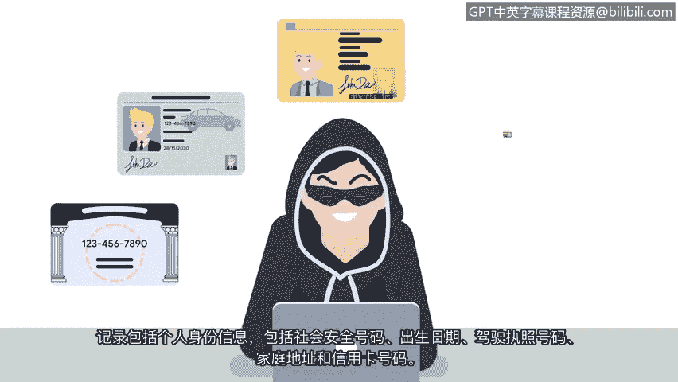

# 013：数字时代的攻击

在本节课中，我们将要学习数字时代两种具有代表性的网络攻击案例，了解恶意软件如何利用互联网传播，以及社会工程学攻击的危害。通过分析这些历史事件，我们可以更好地理解现代网络安全威胁的演变和防御的重要性。

---

随着可靠高速互联网的普及，连接到互联网的计算机数量急剧增加。由于恶意软件可以通过互联网传播，威胁行为者不再需要使用物理磁盘来传播病毒。为了更好地理解数字时代的攻击，我们将讨论两个依赖互联网的著名攻击案例：“爱虫”攻击和Equifax数据泄露事件。

## “爱虫”攻击与社会工程学

在2000年，奥尼尔·德·古兹曼创建了“爱虫”恶意软件，旨在窃取互联网登录凭证。这次攻击迅速蔓延，并利用了当时人们对未经请求的电子邮件缺乏警惕性的弱点。

以下是“爱虫”攻击的基本流程：

1.  **传播方式**：用户收到一封主题为“I love you”的电子邮件。
2.  **恶意附件**：每封邮件都包含一个名为“LOVE-LETTER-FOR-YOU”的附件。
3.  **自动传播**：当附件被打开后，恶意软件会扫描用户的通讯录。
4.  **信息窃取**：软件自动将自身发送给通讯录中的每个人，并安装程序以收集用户信息和密码。

收件人会以为邮件来自朋友，但实际上这是恶意软件。“爱虫”最终感染了全球4500万台计算机，据信造成了超过100亿美元的损失。

“爱虫”攻击是社会工程学的第一个典型案例。**社会工程学**是一种利用人为错误来获取私人信息、访问权限或贵重物品的操纵技术。在“爱虫”事件之后，攻击者认识到了社会工程学的威力。

随着每一个允许公开访问个人数据的新社交媒体应用的出现，社会工程学攻击的数量正在增加。如今，许多人将便利性置于隐私之上。这种不断变化的趋势带来的权衡是，如果人们不恰当地使用这些工具，可能会导致脆弱性增加。

作为一名安全专业人员，你的职责是识别和管理可能使你的组织及其相关人员面临风险的技术不当使用行为。保护组织的一种方法是进行定期的内部培训，作为未来的安全分析师，你可能会被要求主导或参与其中。如今，员工接受如何识别社会工程学攻击（特别是通过他们收到的电子邮件进行的**网络钓鱼**）的培训已很常见。**网络钓鱼**是指利用数字通信欺骗人们泄露敏感数据或部署恶意软件。

## Equifax数据泄露事件

现在，让我们来讨论Equifax数据泄露事件。2017年，攻击者成功侵入了信用报告机构Equifax。这导致了已知最大规模的敏感信息数据泄露事件之一。

以下是该事件的关键信息：

*   **影响范围**：超过1.43亿条客户记录被盗，影响了大约40%的美国人。
*   **泄露信息**：记录包括个人身份信息，如社会安全号码、出生日期、驾驶执照号码、家庭住址和信用卡号码。
*   **安全漏洞**：从安全角度来看，此次泄露是由于Equifax方面的多重失误造成的。攻击者利用的并非单一漏洞，而是多个漏洞。
*   **后续处理**：该公司在数据泄露发生前的几个月里，未能采取必要措施修复多个已知漏洞。最终，Equifax与美国政府达成和解，支付了超过5.75亿美元来解决客户投诉并支付所需罚款。

虽然在Equifax事件前后还有其他数据泄露事件，但这次与美国政府达成的大额和解案警示了各公司数据泄露带来的财务影响以及实施预防措施的必要性。

---

本节课中我们一起学习了数字时代两个标志性的网络安全事件：“爱虫”攻击和Equifax数据泄露。这些只是塑造了安全行业的众多知名事件中的几个。了解它们将有助于你的安全职业生涯。

理解不同类型的恶意软件和社会工程学攻击，将使你能够在未来的工作面试中更好地沟通安全风险。作为一名未来的安全专业人员，不断适应并自我教育，了解威胁行为者、策略和技术，将是你工作的一部分。通过注意类似的趋势、模式和方法，你可能能够识别潜在的漏洞并限制未来的损害。

最后，理解安全如何影响人们的生活，能很好地提醒你，为什么你将要做的工作如此重要。