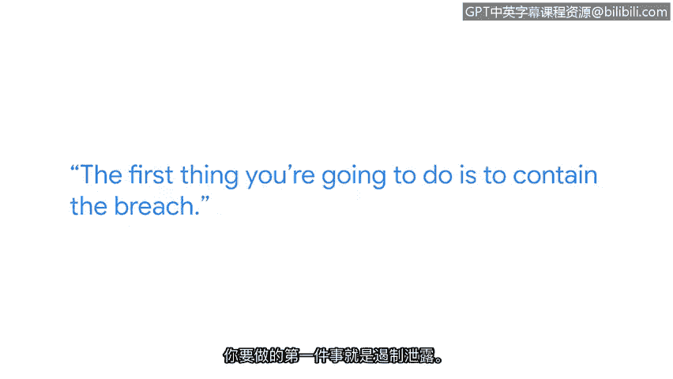

# 014：在数据泄漏期间保持冷静

## 概述
在本节课中，我们将学习在应对数据泄漏事件时，保持冷静并遵循结构化响应流程的重要性。我们将重点了解事件响应初期的核心任务：**遏制**。

---

上一节我们介绍了数据泄漏的潜在影响，本节中我们来看看事件发生时的具体应对策略。

当数据泄漏首次发生时，你能做的最重要的事情是保持冷静。你周围的每个人可能都会惊慌失措。如果你是安全团队的一员并且正在管理该事件，你必须成为房间里真正保持冷静的人。成为那个能在对话中保持停顿的人。有人可能会问：“你知道发生了什么吗？” 你可以回答：“我当然知道。”

我认为我经历过最大的泄漏事件，始于一个电话。另一家金融机构的一位工程师在eBay上购买了一台服务器。他启动那台服务器时，发现它没有被擦除数据，上面存有**2000万条信用卡记录**。这引发了一次全面的审查。

我们当时没有控制如何与第三方处理数据，因为我们正在将数据中心外包。问题在于：**第三方如何擦除我们不再使用的服务器？**

---

在了解了保持冷静的重要性后，接下来我们需要明确事件响应的首要步骤。

以下是事件响应初期的核心行动列表：
*   **首要任务：遏制泄漏**。如果你仍在流失数据，你需要按步骤进行以阻止数据继续流失。
*   **执行遏制措施**。这可能意味着关闭服务器、关闭数据中心或关闭通信。无论采取何种方式，**停止数据丢失是你的第一要务**。
*   **明确职责**。作为事件经理或处理泄漏的人员，你的工作是先阻止泄漏，然后再调查泄漏。

---

因此，执行你的事件管理计划是入门级人员最需要牢记于心的事情。

## 总结
本节课中我们一起学习了在数据泄漏事件中保持冷静的关键性，并明确了事件响应的初期核心是**执行计划、优先遏制**。记住，首要目标是阻止数据的进一步流失，为后续的调查和修复工作奠定基础。