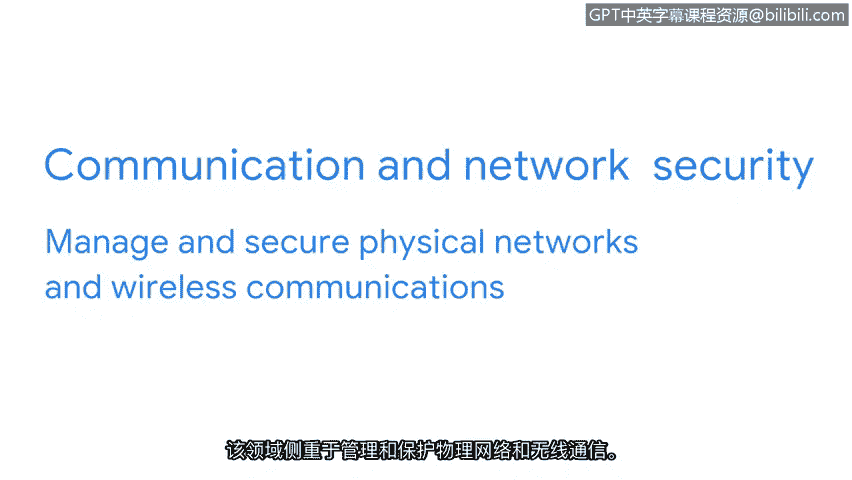

# 015：CISSP八大安全领域介绍（上）🔐

在本节课程中，我们将学习信息安全领域的核心组织框架——CISSP定义的八大安全领域。我们将重点介绍前四个领域，了解它们各自关注的焦点以及安全分析师在其中可能承担的任务。

随着威胁行为者策略的演变，安全专业人员的角色也在不断发展。扎实理解核心安全概念将支持您在该领域的成长。为了更好地理解这些核心概念，一种方法是将它们组织成称为“安全领域”的类别。截至2022年，CISSP定义了八个领域来组织安全专业人员的工作。

理解这些领域相互关联至关重要，因为一个领域的疏漏可能导致整个组织承受负面后果。理解这些领域也很重要，因为它可能帮助您更好地明确职业目标以及您在组织内的角色。当您了解更多关于每个领域的要素时，可能会发现其中某个领域的工作比其他领域更吸引您，这或许会成为您未来深入探索的职业道路。

CISSP总共定义了八个领域，我们将在本视频和下一个视频中讨论全部八个。在本视频中，我们将涵盖前四个领域。

---

## 1. 安全与风险管理 📊

安全与风险管理领域侧重于定义安全目标和目的、风险缓解、合规性、业务连续性和法律事务。

以下是该领域可能涉及的具体工作示例：
*   例如，如果联邦合规法规（如《健康保险携带和责任法案》，简称HIPAA）发生变化，安全分析师可能需要更新公司关于私人健康信息的政策。

---

## 2. 资产安全 💾

上一节我们介绍了如何从宏观层面管理安全与风险，本节中我们来看看对具体资产的保护。资产安全领域专注于保护数字和物理资产，同时也涉及数据的存储、维护、保留和销毁。

在处理此领域时，安全分析师可能承担以下任务：
*   确保旧设备（包括任何类型的机密信息）得到妥善处置和销毁。

---

## 3. 安全架构与工程 🏗️

在确保资产安全之后，我们需要构建和维护保护这些资产的系统。安全架构与工程领域侧重于通过确保部署有效的工具、系统和流程来优化数据安全。

作为一名安全分析师，您可能需要完成以下配置任务：
*   配置防火墙。防火墙是一种用于监控和过滤进出计算机网络流量的设备。正确设置防火墙有助于防止可能影响生产力的攻击。

---

## 4. 通信与网络安全 🌐

最后，我们来探讨支撑所有数字交互的基础设施。通信与网络安全领域侧重于管理和保护物理网络及无线通信。

作为安全分析师，您可能会被要求分析组织内的用户行为。想象一下，如果发现用户连接到不安全的无线热点，这可能使组织及其员工容易受到攻击。为了确保通信安全，您需要创建网络策略来预防和减轻这种暴露风险。

---

维护组织的安全是一项团队工作，涉及许多动态环节。作为一名入门级分析师，您将通过学习如何降低风险以保护人员和数据安全来持续发展您的技能。您无需精通所有领域，但对它们有基本的了解将有助于您在安全专业人员的道路上成长。

您做得很好。我们刚刚介绍了前四个安全领域。在下一个视频中，我们将讨论另外四个领域。再见。

