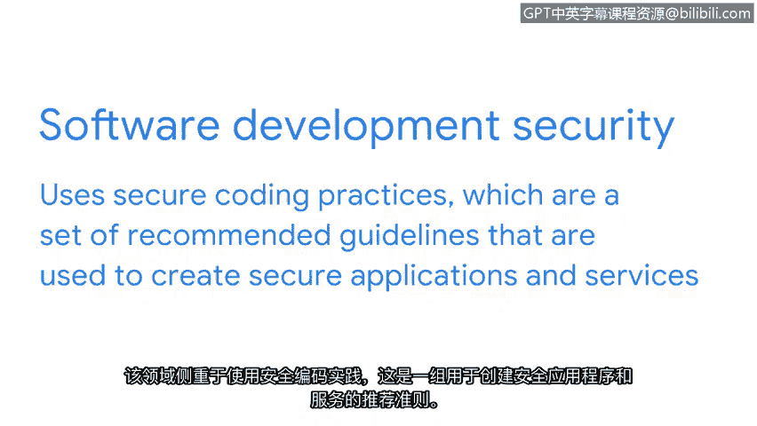

# 016：CISSP八大安全领域介绍（下）🔐

在本节课程中，我们将继续学习CISSP（国际信息系统安全认证联盟）的另外四个安全领域。熟悉这些领域将帮助你理解安全专业人员如何协同工作，以保护组织的复杂安全环境。

上一节我们介绍了前四个安全领域，本节中我们来看看剩下的四个领域：身份与访问管理、安全评估与测试、安全运营以及软件开发安全。

## 身份与访问管理 👤

身份与访问管理领域专注于通过确保用户遵循既定策略，来控制和管理物理资产（如办公空间）与逻辑资产（如网络和应用程序），从而保障数据安全。验证员工身份并记录其访问角色，对于维护组织的物理和数字安全至关重要。

例如，作为安全分析师，你的任务可能是设置员工的钥匙卡，以控制其对办公楼的访问权限。

## 安全评估与测试 🧪

安全评估与测试领域侧重于进行安全控制测试、收集分析数据以及执行安全审计，以监控风险、威胁和漏洞。安全分析师可能会定期审计用户权限，以确保用户拥有正确的访问级别。

以下是该领域的一些核心活动：
*   进行安全控制测试。
*   收集并分析安全相关数据。
*   执行安全审计以监控风险。

例如，访问薪资信息通常仅限于特定员工，因此分析师可能被要求定期审计权限，以确保未经授权的人员无法查看员工薪资。

## 安全运营 🛡️

安全运营领域侧重于进行调查和实施预防措施。想象一下，你作为一名安全分析师，收到一个警报，显示有一个未知设备连接到了你的内部网络。你需要遵循组织的策略和程序，迅速阻止这一潜在威胁。

## 软件开发安全 💻

软件开发安全领域侧重于使用安全编码实践。这是一套用于创建安全应用程序和服务的推荐准则。

安全分析师可能与软件开发团队合作，以确保安全实践被纳入软件开发生命周期。例如，如果你的一个合作团队正在开发一个新的移动应用程序，那么你可能会被要求就密码策略提供建议，或确保任何用户数据都得到妥善保护和管理。

---

本节课中我们一起学习了CISSP的后四个安全领域：身份与访问管理、安全评估与测试、安全运营以及软件开发安全。尽管在课程初期这些概念可能还有些模糊，但在接下来的课程中，我们将对它们进行更详细的探讨。