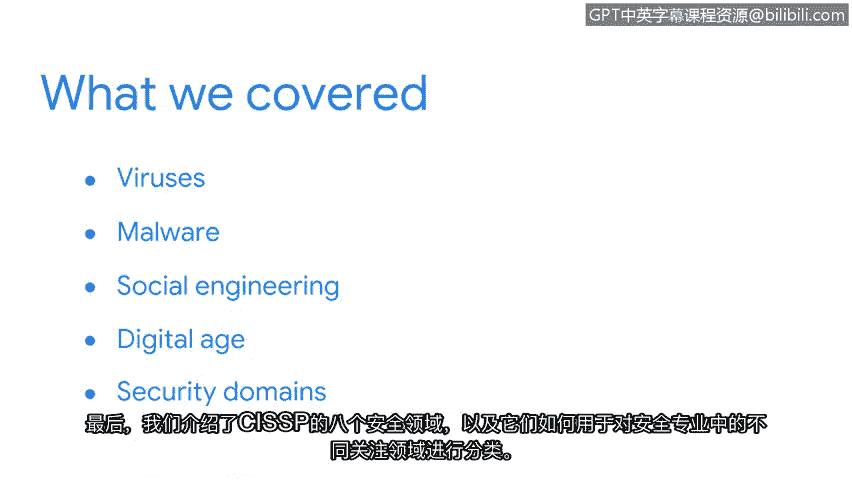

# 017：总结

在本节课中，我们回顾了历史上一些最具影响力的安全攻击案例，并介绍了CISSP的八个安全域。本节将对之前讨论的内容进行总结。

## 📜 历史攻击回顾

上一节我们介绍了CISSP的八个安全域，本节中我们来回顾一下讨论过的核心安全攻击案例。

以下是本节课涵盖的主要攻击类型：

*   **病毒与蠕虫**：我们介绍了**Brain病毒**和**Morris蠕虫**，并讨论了这些早期恶意软件如何塑造了安全行业。许多现代攻击都是这些早期案例的变体。
*   **社会工程学**：通过学习**“爱虫”病毒攻击**，我们了解了攻击者如何利用人类心理而非技术漏洞。
*   **威胁动机与影响**：通过分析**Equifax数据泄露事件**，我们探讨了威胁行为者的动机，以及数字时代安全漏洞造成的广泛影响和相关成本。

理解历史上的攻击对于安全专业人员至关重要，这有助于他们保护组织和个人免受未来可能出现的变体攻击。

## 🗂️ CISSP安全域框架

在回顾了具体攻击案例后，我们引入了一个组织安全工作的框架。

我们介绍了**CISSP的八个安全域**。这个框架用于对安全专业内的不同重点领域进行分类，为安全人员的工作提供了结构化的视角。

## 💎 总结与展望

本节课中，我们一起学习了信息安全的历史基础与行业框架。

学习安全历史能帮助你更好地理解当前行业。CISSP的八个安全域提供了一种组织安全专业人员工作的方法。请记住，每一位安全专业人员都至关重要。你独特的观点、专业背景和知识都具有宝贵价值。你为这个领域带来的多样性，将在你努力保护组织和人员安全的同时，进一步推动安全行业的发展。