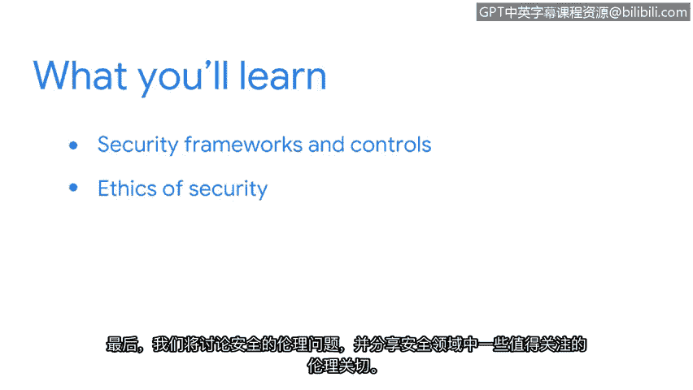

# 018：欢迎来到第三周

你好。很高兴你回来。你已经完成了第一门课程的一半。这说明你取得了很大的进展。

在本节中，我们将讨论组织如何通过涵盖关键原则来保护自己免受威胁、风险和漏洞的影响，例如框架、控制和道德规范。这将帮助你更好地理解这与安全分析师角色的关联。

我们将使用一个类比。假设你想建造一个花园。你需要研究、规划、准备和购买材料，同时考虑所有可能对你的花园构成风险的因素。你制定计划来除草、喷洒杀虫剂和定期浇水，以防止问题或事件发生。

但是随着时间推移，意外问题出现了。天气变得难以预测，害虫正积极地试图侵入你的花园。

你开始实施更好的方法来保护你的花园，例如安装监控摄像头、建造围栏、用遮阳篷覆盖植物，以保持花园的健康生长。

现在你对花园面临的威胁以及如何保护植物有了更清晰的认识，你建立了更好的政策和程序来持续监控和保护你的花园。

从这个角度看，安全防护就像一个花园。这是一个不断发展的行业，它要求你持续改进政策和程序，以帮助保护你的组织及其服务对象。

为此，我们将介绍安全框架和控制措施，并解释它们的重要性。

我们还将涵盖框架和控制措施的核心组件及具体示例，包括**机密性、完整性、可用性三要素**，即 **CIA Triad**。

最后，我们将讨论安全道德规范，并分享安全领域中一些值得注意的道德问题。

不断发展的安全实践可能看起来有些抽象，但我们很多人每天都在使用它们。

例如，我使用安全密钥（一种安全控制措施）作为访问账户的第二重身份验证形式。

这些密钥确保即使密码被泄露，也只有我能访问我的账户。通过增强**机密性**，它们也保证了**我账户的完整性**完好无损。

对于任何组织来说，建立流程和程序来组织安全工作并做出明智决策都非常重要。

我很高兴开始学习，希望你也一样。

