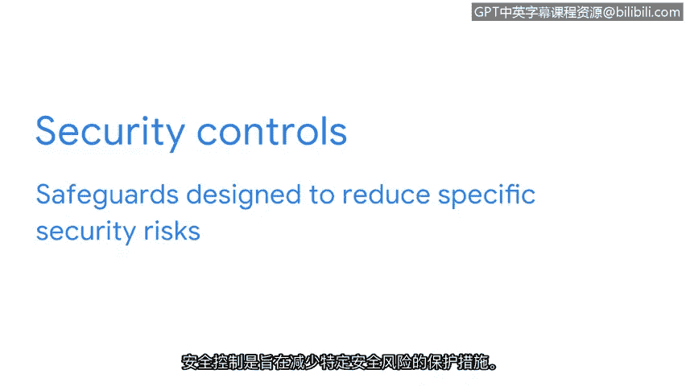

# 019：安全框架与控制简介 🔐

在本节课中，我们将要学习安全框架与安全控制的核心概念。它们是信息安全专业人员用于持续识别、管理风险，并保护组织数据和隐私的基础工具。

---

想象一下，你作为一名安全分析师，收到了多条关于网络上可疑活动的警报。你意识到需要实施额外的安全措施，以防止这些警报演变为严重的安全事件。那么，应该从哪里开始呢？作为一名分析师，你将从识别组织的关键资产和风险开始。然后，你将实施必要的框架和控制措施。

上一节我们提到了识别风险的重要性，本节中我们来看看如何系统地管理这些风险。我们将讨论安全专业人员如何使用框架来持续识别和管理风险，并介绍如何使用安全控制来管理或降低特定风险。

## 安全框架

安全框架是用于构建计划的指导方针，旨在帮助减轻对数据和隐私的风险与威胁。安全框架为实施安全生命周期提供了一个结构化的方法。安全生命周期是一套不断发展的政策和标准，定义了组织如何管理风险、遵循既定指南并满足法规遵从性或法律要求。

有多种安全框架可用于管理不同类型的组织和法规遵从性风险。安全框架的目的包括：
*   保护个人可识别信息。
*   保护财务信息。
*   识别安全弱点。
*   管理组织风险。
*   使安全目标与业务目标保持一致。

框架有四个核心组成部分，理解它们将使你能够更好地管理潜在风险。

以下是安全框架的四个核心组成部分：

1.  **识别并记录安全目标**。例如，一个组织的目标可能是遵循欧盟的《通用数据保护条例》。GDPR 是一项数据保护法，旨在赋予欧洲公民对其个人数据的更多控制权。安全分析师可能被要求识别并记录组织在哪些方面不符合 GDPR 要求。
2.  **设定实现安全目标的指南**。例如，在实施实现 GDPR 合规性的指南时，你的组织可能需要制定新的政策，以处理来自个人用户的数据请求。
3.  **实施强大的安全流程**。以 GDPR 为例，为社交媒体公司工作的安全分析师可能帮助设计程序，以确保组织遵守已验证的用户数据请求。此类请求的一个例子是当用户尝试更新或删除其个人资料信息时。
4.  **监控并沟通结果**。例如，你可能监控组织的内部网络，并向你的经理或法规遵从官报告可能影响 GDPR 的潜在安全问题。

现在我们已经介绍了安全框架的四个核心组成部分，让我们将它们整合起来。框架使分析师能够与安全团队的其他成员一起工作，以记录、实施和使用已创建的政策和程序。对于初级分析师来说，理解这个过程至关重要，因为它直接影响他们的工作方式以及与他人的协作。

## 安全控制

接下来，我们将讨论安全控制。安全控制是旨在降低特定安全风险的防护措施。例如，你的公司可能有一项指南，要求所有员工完成隐私培训，以降低数据泄露的风险。

作为一名安全分析师，你可能使用软件工具来自动分配并跟踪哪些员工已完成此培训。

---

本节课中我们一起学习了安全框架与安全控制。安全框架提供了管理风险的结构化蓝图，其四个核心组件——目标设定、指南制定、流程实施与结果监控——构成了持续安全管理的基石。安全控制则是落实框架要求、降低具体风险的具体防护措施。它们是各类组织管理安全、确保每个人为维持低风险水平而尽责的关键工具。理解其目的和使用方法，使分析师能够支持组织的安全目标并保护其所服务的人员。

在接下来的视频中，我们将讨论一些分析师需要了解的知名框架和原则，以最大限度地降低风险并保护数据和用户。