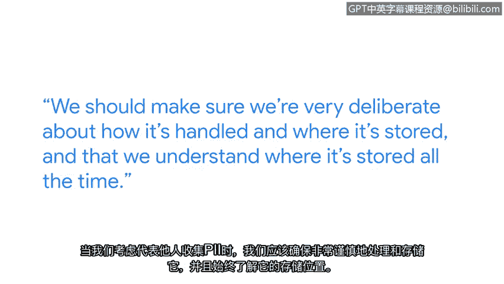

**谷歌网络安全专业证书课程：第一课：《信息安全基础》：保护敏感数据和信息**

在本节课中，我们将学习个人身份信息的重要性、保护它的必要性，以及未能妥善处理这些信息可能带来的后果。我们还将探讨如何了解并遵守相关的法律法规。

大家好，我是希瑟，谷歌安全工程副总裁。自互联网诞生之初，个人身份信息就一直是网络上的重要议题。随着时间的推移，我们一直在探讨日益复杂的方法来保护这些数据。

当我们考虑代表他人收集个人身份信息时，必须确保我们对其处理方式和存储位置有非常审慎的规划，并且始终清楚其存储位置。根据你所处的角色，你可能还需要保护这些数据以符合法规或法律的要求。因此，理解数据与这些义务之间的关系至关重要。

如果一个组织未能履行其义务，可能会发生一系列后果。

以下是可能发生的几种情况：

*   **监管审查**：政府监管机构可能会更加关注并调查公司处理数据的具体做法。
*   **客户质询**：消费者、客户或商业伙伴可能会开始直接向公司询问其数据处理方式。这可能会成为客户关系的一部分，如果数据非常敏感，这一点将变得越来越重要。
*   **法律诉讼**：如今，网络安全事件的受害者起诉公司不当处理其数据的情况并不少见。

你可以通过查询相关司法管辖区的官方网站，来及时了解关于个人身份信息的合规要求、法规和法律。许多政府网站现在都会公布关于数据处理的法律、法规和合规要求。

管理个人身份信息处理方式的法规和法律在全球范围内都非常复杂。不同的国家、州、县都在不同层面上进行监管。了解并意识到这些法律的存在非常重要。然而，如果你对特定法律有疑问，务必就该特定司法管辖区的问题寻求法律顾问的建议，因为它可能与你所在的司法管辖区有很大不同。

本节课中，我们一起学习了保护个人身份信息的重要性、不当处理可能引发的监管、商业及法律风险，以及如何通过官方渠道和法律咨询来确保合规。理解并遵守这些原则是信息安全实践的基础。