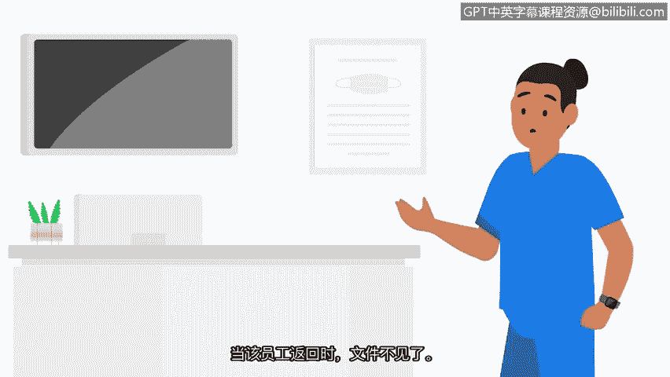

# 022：网络安全中的道德原则 🔐

在本节课中，我们将要学习网络安全领域中的核心道德原则。这些原则是安全专业人员做出正确决策的基石，尤其是在面对复杂和模糊的情况时。

---

在安全领域，每一项新技术都会为每一个新的安全事件或风险带来新的挑战。正确或错误的决定并非总是清晰明了。

例如，假设你是一名初级安全分析师，收到了一条高风险警报。你调查该警报，发现数据在未经授权的情况下被转移。你努力追查转移者，发现是你的一位工作上的朋友。此时你该怎么做？从道德上讲，作为一名安全专业人员，你的职责是保持公正，并维护安全与保密性。虽然保护朋友是人之常情，但无论涉及的用户是谁，你的责任和义务都是遵守你所受培训的政策和协议。

在许多情况下，安全团队被授予比其他员工更高的数据和信息访问权限。安全专业人员必须尊重这种特权，并始终保持道德行为。安全道德是指导安全专业人员做出适当决策的准则。

再举一个例子，如果你作为一名分析师，有能力授予自己访问薪资数据的权限，并且仅仅因为拥有此权限就给自己加薪，这是否意味着你应该这样做？答案是否定的。你绝不应滥用被授予和信任的访问权限。

接下来，让我们讨论在制定风险缓解方案时可能引发问题的道德原则。这些原则是**保密性**、**隐私保护**和**法律**。

---

上一节我们提到了道德决策的复杂性，本节中我们来看看第一个道德原则：保密性。

之前，我们讨论过保密性是CIA三要素的一部分。现在，我们来讨论保密性如何应用于道德层面。作为一名安全专业人员，你会接触到专有或私人信息，例如**PII**。你有道德责任对这些信息进行保密并确保其安全。

例如，你可能想通过非正规记录渠道为同事提供计算机系统访问权限来帮助他们。然而，这种违反道德的行为可能导致严重后果，包括受到训斥、损害你的职业声誉，以及对你和你的朋友都造成法律后果。

---

在理解了保密性的重要性后，我们接下来探讨第二个关键原则：隐私保护。

隐私保护意味着保护个人信息免遭未经授权的使用。

例如，假设你在下班后收到经理的一封私人邮件，要求你提供一位同事的家庭电话号码。你的经理解释说他们目前无法访问员工数据库，但需要与那个人讨论一个紧急事项。作为一名安全分析师，你的角色是遵循公司的政策和程序。在这个例子中，公司政策规定员工信息存储在安全数据库中，绝不应以任何其他格式访问或共享。因此，访问和共享该员工的个人信息将是不道德的。

在这种情况下，可能很难知道该怎么做。所以最好的回应是遵守组织制定的政策和程序。

---

除了保密和隐私，安全专业人员还必须遵守第三个重要的道德原则：法律。

法律是被社会认可并由管理机构执行的规则。

例如，考虑一家医院的一名工作人员，他受过处理PII和SPII的合规培训。该工作人员拥有不应无人看管的机密数据文件，但他开会迟到了。他没有将文件锁在指定区域，而是将文件留在了无人看管的办公桌上。等他回来时，文件不见了。这名工作人员刚刚违反了多项合规规定，他的行为是不道德且非法的，因为他的疏忽很可能导致了私人患者和医院数据的丢失。

---

当你进入安全领域时，请记住技术是不断发展的，攻击者的策略和技术也在不断演变。正因如此，安全专业人员必须持续批判性地思考如何应对攻击。拥有强烈的道德感可以指导你的决策，确保遵循正确的流程和程序，以缓解这些不断演变的风险。

---

本节课中我们一起学习了网络安全中的三大核心道德原则：**保密性**、**隐私保护**和**遵守法律**。这些原则是安全专业人员职业行为的指南针，帮助我们在复杂情境中做出正确、合规且负责任的决策，从而有效保护组织的信息资产。