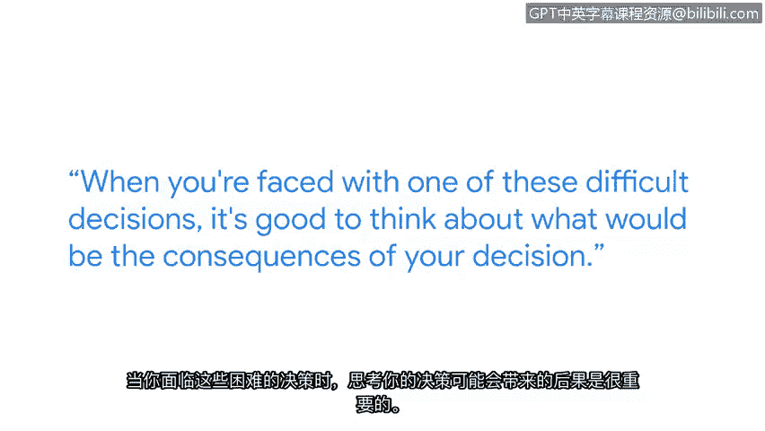

# 023：作为网络安全专业人员的道德重要性

在本节课中，我们将跟随谷歌云安全架构师荷莉，探讨道德在网络安全领域的核心地位。我们将了解不道德行为的例子，分析一个真实的道德困境案例，并思考如何做出符合职业道德的决策。

大家好，我是荷莉，是谷歌云的一名云安全架构师。

在我职业生涯初期，我一边上学一边销售袜类产品。这份工作为我带来了进入银行业的机会。之后，我又从银行业进入了电信行业工作。从那里，我设法进入了一家安全供应商公司，并开始学习安全知识。

我能够从技术生涯前半段的数据库管理员成功转型进入网络安全领域，部分原因在于我获得了相关证书，就像你们今天正在做的一样。在我尚未拥有该领域经验时，这些证书确实帮助我在潜在雇主面前建立了可信度。

## 道德是网络安全的核心

上一节我们了解了荷莉的职业转型路径，本节中我们来看看她对于网络安全职业道德的看法。

道德确实是网络安全的关键。为了成为一名网络安全专业人员，你必须在所有行动中都能保持道德。

## 不道德行为的例子

以下是几种常见的不道德行为示例，它们通常源于轻微的懒惰或人们走捷径，并未认真考虑其行为的后果。

*   人们共享系统密码。
*   人们泄露私人信息。
*   人们出于个人目的或为了了解他们认识的人或名人而查看系统信息。

## 面对道德困境

在技术生涯中，我遇到的最困难的道德困境之一发生在9/11事件后不久。我上司的上司的上司带着一堆明显与纽约袭击事件相关的关键词来找我，要求我查询我所管理的数据库。该数据库存储了整个电信公司所有用户的短信内容，而他的要求既没有书面文件，也没有法院命令。

我处于一个非常尴尬的境地，需要告诉一位比我资深得多的人，我对此感到不安。我建议他提供书面文件给我，以便执行此操作。后来，他找了其他人替他完成了这件事。

## 如何做出决策

当你面临这类艰难决定时，最好思考一下你的决定可能带来的后果。

我对正在学习本课程的各位的鼓励是：通过帮助保护你的公司、用户或组织免受网络犯罪分子的侵害，你所获得的回报是非常巨大的。我们可以成为守护者，帮助保护我们的行业和客户免受网络攻击和网络犯罪分子的侵害。这很有意义。

本节课中，我们一起学习了道德在网络安全职业中的根本重要性。我们通过具体例子认识了不道德行为，并跟随荷莉回顾了一个真实的道德困境案例，理解了在面临压力时坚持原则、思考后果的重要性。记住，网络安全从业者是保护数字世界的“好人”，这份职业的回报来自于守护安全所带来的成就感。