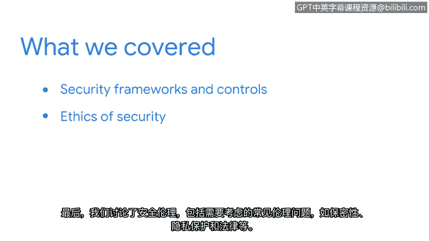

**谷歌网络安全专业证书课程：第一课：《信息安全基础》：P24：总结**

在本节课中，我们回顾了信息安全基础的核心概念，为理解和参与风险评估与管理决策做好了准备。

上一节我们探讨了具体的框架与伦理问题，现在让我们来总结本课程涵盖的全部要点。

以下是本课程的核心内容回顾：

*   **安全框架与控制措施**：我们讨论了安全框架与控制措施，及其在制定保护组织与其服务对象流程与规程中的应用。
*   **框架核心组件**：我们分析了框架的核心组件，例如识别安全目标与建立实现这些目标的指导原则。
*   **具体框架介绍**：我们介绍了具体框架与控制模型，包括**CIA三元组（机密性、完整性、可用性）** 和**NIST网络安全框架（CSF）**，并说明了它们如何用于风险管理。
*   **安全伦理**：我们探讨了安全伦理，涵盖了需要考虑的常见伦理问题，例如保密性、隐私保护及相关法律。

本节课中，我们一起学习了信息安全的基础支柱——从宏观的框架、控制措施到具体的实施模型与伦理考量。这些知识构成了评估和管理网络安全风险的坚实基础。

---

课程即将进入尾声，仅剩最后一个部分。接下来，你将学习安全分析师用于保护组织运营的常用工具与编程语言。

希望你和我一样，对继续学习充满期待。