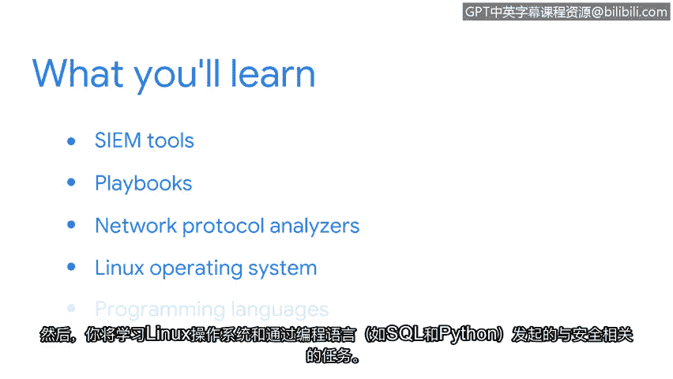

# 025：欢迎来到第四周 🚀


在本节课中，我们将学习网络安全领域中常用的工具和编程语言。这些工具对于监控组织的安全状况至关重要，因为它们能通过自动化任务来提升效率。虽然本节只是初步介绍这些概念和工具，但在后续的课程中，你将有机会在各种实践活动中亲自使用它们。

## 课程概述 📋

本节课程将引导你了解几种核心的安全工具与技术。首先，我们会介绍安全信息和事件管理工具。接着，你将接触到其他实用工具，例如预案手册和网络协议分析器。最后，我们将探讨Linux操作系统以及通过SQL和Python等编程语言执行的安全相关任务。

## 核心工具介绍 🛠️

上一节我们概述了本单元的学习目标，本节中我们来看看将要学习的具体工具。

以下是本单元将介绍的主要工具类别：

*   **安全信息和事件管理工具**：这类工具用于集中收集和分析整个组织的安全日志与事件数据。
*   **预案手册**：这是记录标准操作流程的文档，用于指导如何响应特定的安全事件。
*   **网络协议分析器**：这类工具可以捕获和检查在网络中传输的数据包，用于诊断问题或分析流量。

## 编程语言与操作系统 💻

了解自动化工具后，我们来看看支撑这些工具运行的基础系统与语言。



以下是本单元将涉及的系统与编程语言：

*   **Linux操作系统**：在安全领域被广泛使用，掌握其基本操作非常重要。
*   **SQL**：一种用于管理和查询数据库的语言，能帮助安全分析师从大量数据中提取有用信息。
*   **Python**：一种功能强大的编程语言，常用于编写自动化脚本、进行安全工具开发和分析任务。

对于许多安全专业人士而言，SQL是最有用的工具之一。它允许分析师探索收集到的各种数据源，并使团队能够分析数据趋势。其查询语句的基本结构可以表示为：
```sql
SELECT 列名 FROM 表名 WHERE 条件;
```

## 学习建议与展望 📚

学习这些新工具和概念时，请循序渐进。如果需要，可以反复观看视频。同时请放心，这些工具在证书课程的后续部分会被更详细地讨论，并且你将有机会进行第一手的实践。

虽然每个组织都有自己的一套工具和培训材料，需要你在工作中学习，但本课程将为你提供扎实的基础知识，帮助你在安全行业取得成功。

## 总结 🎯

本节课中我们一起学习了网络安全领域的核心工具与基础技术。我们介绍了用于集中监控的SIEM工具、指导应急响应的预案手册、分析网络流量的协议分析器，以及Linux操作系统、SQL和Python这两种重要的编程语言。这些构成了安全分析师工作的技术基础，掌握它们将极大地提升你的工作效率和能力。现在，让我们开始学习吧。