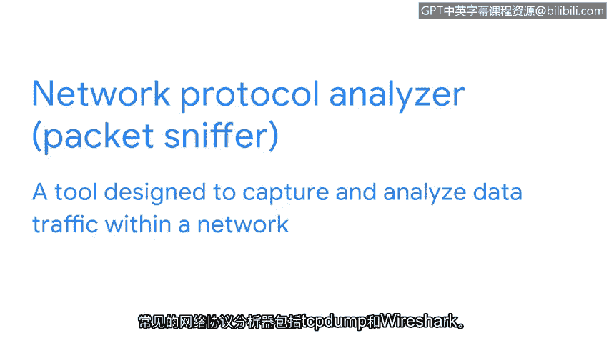

# 026：常见的网络安全工具

在本节课程中，我们将学习网络安全分析师常用的几种核心工具。这些工具是识别、评估和缓解安全风险的关键。

正如之前提到的，安全就像为暴风雨做准备。如果你发现了一个漏洞，用来接水的桶的颜色或形状并不重要。重要的是利用你手头的工具来减轻对你家园的风险和威胁。

作为一名初级安全分析师，你的工具箱里将有许多工具可以用来缓解潜在风险。本节视频将讨论一些常用安全工具的主要目的和功能。在本证书课程的后续部分，你将有机会进行实际操作练习。

在深入讨论工具之前，我们先简要了解一下日志。日志是这些工具旨在组织和处理的数据来源。**日志**是记录组织系统内发生事件的记录。与安全相关的日志示例包括员工登录计算机或访问基于网络服务的记录。日志帮助安全专业人员识别漏洞和潜在的安全漏洞。

## 安全信息与事件管理工具

我们将讨论的第一类工具是安全信息与事件管理工具，简称 **SIEM** 工具。SIEM 工具是一种收集和分析日志数据以监控组织关键活动的应用程序。SIEM 这个缩写可以读作 “SIim” 或 “Sim”，在本课程中我们统一使用 “SIim”。

SIim 工具收集实时或即时信息，使安全分析师能够在事件发生时识别潜在的入侵。想象一下，为了确定是否存在安全威胁，你必须阅读一页又一页的日志。根据数据量的不同，这可能花费数小时甚至数天。SIim 工具通过为特定类型的风险和威胁提供警报，减少了分析师必须审查的数据量。

接下来，我们看看常用的 SIim 工具示例：Splunk 和 Chronicle。

以下是两种常见的 SIim 工具：

*   **Splunk**：Splunk 是一个数据分析平台。Splunk Enterprise 提供 SIEM 解决方案。Splunk Enterprise 是一个自托管工具，用于保留、分析和搜索组织的日志数据。
*   **Chronicle**：Chronicle 是谷歌的 SIEM 工具。Chronicle 是一个云原生的 SIEM 工具，用于存储安全数据以供搜索和分析。**云原生**意味着 Chronicle 允许快速交付新功能。

这两种 SIEM 工具，以及一般的 SIEM 系统，都从多个来源收集数据，然后分析和过滤这些数据，使安全团队能够预防并快速应对潜在的安全威胁。作为安全分析师，你可能会使用 SIim 工具来分析过滤后的事件和模式、执行事件分析或主动搜索威胁。根据你组织的 SIEM 设置和风险关注点，工具及其功能可能有所不同，但最终它们都用于降低风险。

## 其他关键工具

除了 SIEM 工具，在安全分析师的角色中，你还会用到其他关键工具，并且在本课程的后续部分也有机会进行实践操作。这些工具包括预案手册和网络协议分析器。

**预案手册**是一本提供任何操作行动细节的手册，例如如何响应事件。预案手册因组织而异，指导分析师在安全事件发生前、发生期间和发生后如何处理。预案手册可以涉及安全或合规性审查、访问管理以及许多其他需要从头到尾记录流程的组织任务。

另一个你可能用到的工具是**网络协议分析器**，也称为**数据包嗅探器**。数据包嗅探器是一种旨在捕获和分析网络内数据流量的工具。

常见的网络协议分析器包括：

*   **TCPDump**
*   **Wireshark**

作为一名初级分析师，你不需要成为这些工具的专家。随着你继续学习本证书课程并获得更多实践练习，你将不断加深对如何使用这些工具来识别、评估和缓解风险的理解。

在本节课中，我们一起学习了网络安全分析师常用的几种核心工具：用于集中监控和分析的 SIEM 工具（如 Splunk 和 Chronicle）、用于标准化响应流程的预案手册，以及用于检查网络流量的网络协议分析器（如 TCPDump 和 Wireshark）。理解这些工具的基本用途是构建你网络安全技能基础的重要一步。