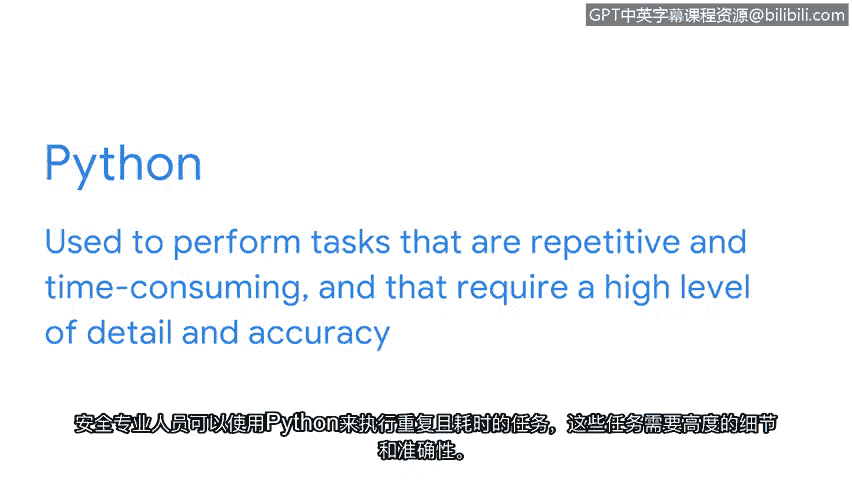

**谷歌网络安全专业证书：第一课：信息安全基础**


**概述**

在本节课中，我们将学习网络安全分析师工具箱中的三个核心工具：Linux操作系统，以及SQL和Python编程语言。了解这些工具的基本概念和用途，是成为一名合格分析师的重要基础。

---

**P27：Linux、SQL和Python简介**

正如我们之前讨论的，组织使用多种工具（如SIEM、预案和数据包嗅探器）来更好地管理、监控和分析安全威胁。

然而，这些并非分析师工具箱中的全部工具。分析师还使用编程语言和操作系统来完成关键任务。在本视频中，我们将向你介绍Python和SQL编程语言，以及Linux操作系统。在本证书课程的后续部分，你将有机会实际练习使用它们。

组织可以使用编程来为计算机创建一套特定的指令以执行任务。编程使分析师能够以极高的准确性和效率完成重复性任务和流程。它还有助于降低人为错误的风险，与手动执行工作相比，可以节省数小时甚至数天的时间。

现在你了解了编程语言的用途，接下来让我们讨论一个特定且相关的操作系统——Linux，以及两种编程语言——SQL和Python。

**Linux操作系统**

Linux是一个开源（即公开可用）的操作系统。与你可能熟悉的其他操作系统（例如macOS或Windows）不同，Linux主要依赖命令行作为主要的用户界面。

Linux本身不是一种编程语言，但它确实允许用户和操作系统之间使用基于文本的命令进行交互。你将在课程后期了解更多关于Linux的知识。

对于初级安全分析师而言，Linux的一个常见用途是检查日志，以更好地理解系统中正在发生的事情。例如，在调查异常高的网络流量时，你可能会使用命令来审查错误日志。

**SQL编程语言**

接下来，让我们讨论SQL。SQL代表结构化查询语言。

SQL是一种用于创建数据库、与数据库交互以及从数据库请求信息的编程语言。数据库是一个有组织的信息或数据集合。

一个数据库中可能包含数百万个数据点。因此，初级安全分析师会使用SQL来筛选这些数据点，以检索特定信息。其基本操作可以表示为：
```sql
SELECT column_name FROM table_name WHERE condition;
```

**Python编程语言**

我们要介绍的最后一个编程语言是Python。



安全专业人员可以使用Python来执行重复、耗时且需要高度细节和准确性的任务。例如，自动化日志分析或编写脚本来检测异常模式。一个简单的Python打印语句示例如下：
```python
print("开始安全分析任务")
```

---

**总结**

作为一名未来的分析师，重要的是要理解，每个组织的工具包可能因其安全需求而有所不同。关键在于熟悉一些行业标准工具，因为这能向雇主展示你具备学习使用他们的工具来保护组织及其服务对象的能力。


你做得很好。在课程后期，你将更深入地学习Linux和编程语言，并将在安全相关的场景中练习使用这些工具。