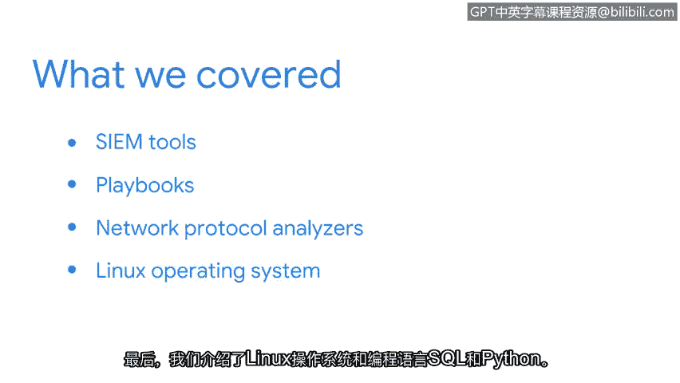

# 028：安全工具与编程语言总结 🛡️

在本节课程中，我们学习了信息安全领域常用的核心工具与编程语言。掌握这些基础知识是成为一名安全分析师的第一步。

上一节我们介绍了安全信息和事件管理工具的基本概念，本节中我们来看看本部分内容的总结。

## 课程内容回顾

我们首先介绍了**SIEM工具**，例如 Splunk 和 Chronicle。这些工具用于集中收集、分析和呈现来自整个组织网络的安全事件数据。

接着，我们探讨了安全分析师如何运用SIEM工具来完成不同的任务，例如日志分析、威胁检测和事件响应。

然后，我们讨论了其他重要的安全工具。以下是其中两类关键工具：
*   **应急预案手册**：这是一套预先定义、书面记录的步骤，用于指导对特定安全事件的响应。
*   **网络协议分析器**（也称为**数据包嗅探器**）：这类工具（如 Wireshark）用于捕获和检查在网络中传输的数据包，以分析网络流量和诊断问题。

最后，我们介绍了**Linux操作系统**以及两种重要的编程语言：**SQL** 和 **Python**。
*   **Linux** 是许多安全工具和服务器的基础操作系统。
*   **SQL**（结构化查询语言）用于与数据库通信和查询数据，其基本查询语句格式为：`SELECT * FROM table_name WHERE condition;`
*   **Python** 是一种通用编程语言，在安全领域常用于编写脚本、自动化任务和进行数据分析，一个简单的打印语句示例如下：`print("Hello, Security World!")`

## 重要提示

需要记住的是，我们所讨论的这些工具都需要时间才能完全掌握。然而，对这些工具具备基本的理解，可以帮助你成功进入安全领域并在职业生涯中取得进步。

本节课中我们一起学习了安全分析师必备的几类核心工具（SIEM、应急预案手册、网络协议分析器）和技能（Linux、SQL、Python），为后续深入学习和实际应用打下了坚实的基础。