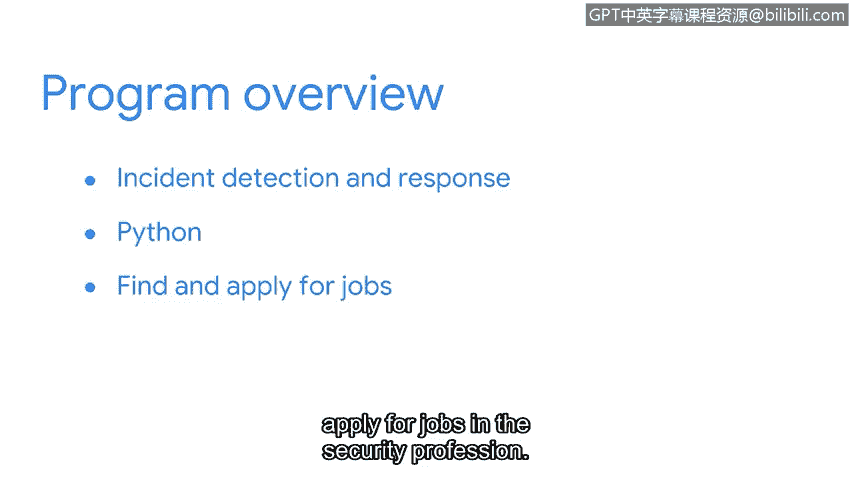

# 030：欢迎来到谷歌网络安全证书课程

## 概述

在本节课中，我们将一起了解谷歌网络安全专业证书课程的概览、学习目标以及课程结构。你将认识课程的主要讲师团队，并了解网络安全行业的前景与机遇。

---

你好，欢迎来到专注于网络安全的谷歌职业证书课程。

我是托尼，谷歌的安全工程经理。

我将担任本证书课程第一门课的讲师。

开始这门课程，意味着你已朝着掌握新技能、助力职业发展迈出了一大步。

网络安全起初可能令人望而生畏，但你会惊讶地发现，我们许多人都有不同的背景。

在进入安全行业获得第一份工作之前，我曾是一名情报分析师。

我很高兴能作为你的讲师，陪伴你开启安全领域的旅程。

对安全专业人员的需求正以惊人的速度增长。到2030年，美国劳工统计局预计安全相关职位的增长将超过30%，远高于其他职业的平均增长率。

全球互联网接入正在扩展。每天都有更多的人和组织采用新的数字技术。

拥有背景、视角和经验各不相同的多元化安全专业人员社区，对于保护和服务不同市场至关重要。

从事安全工作让我有机会与世界各地的人们合作。

与背景多元的人合作，能确保我们的团队提出更多问题，并想出更具创造性的解决方案。

安全工作的主要目标是保护组织和个人。

这份工作让你能够支持并与全球各地的人们互动。

初级安全分析师职位有很多空缺，雇主们正苦于找不到足够多具备合适专业知识的候选人。

本课程旨在为你提供在安全领域起步或晋升所需的知识和技能。

无论你当前的技能水平如何，完成本证书课程后，你将准备好寻找安全相关的工作或在安全领域拓展职业生涯。

你可能想知道，安全专业人员到底做什么？

你是否曾经为了包含数字或特殊符号而在线更新过密码？如果是，那么你已经熟悉了密码管理等基本安全措施。

如果你曾收到过服务提供商关于数据被盗或软件被黑的通知，那么你就亲身体验过安全漏洞的影响。

如果你曾问过自己组织如何保护数据，那么你已经具备了在这个行业取得成功所需的两项重要特质：好奇心和热情。

安全分析师帮助最小化组织和个人面临的风险。

分析师致力于主动防范事件发生，同时持续监控系统和网络。

如果事件确实发生，他们会进行调查并报告发现。他们总是在提问并寻找解决方案。

安全行业最棒的一点在于它为你提供了许多路径和职业选择。

每个选择都涉及一套独特的技能和责任。无论你的背景如何，你可能会发现自己已经拥有一些相关经验。

如果你喜欢与他人合作并帮助他人，喜欢解决难题，并且受到挑战的激励，那么这就是适合你的职业。

例如，我作为情报分析师的背景与网络安全毫无关系。然而，当我决定从事安全职业时，强大的批判性思维和沟通技巧为我的成功奠定了坚实的基础。

如果你不确定想在安全行业选择哪个方向，这没关系。

本课程将为你概述许多不同类型的可用工作。

它还将让你探索某些专业技能组合，帮助你确定职业发展方向。

谷歌职业证书由谷歌内部拥有数十年经验的行业专业人士设计。

在每门课程和整个证书学习过程中，都将有不同的谷歌专家指导你。

我们将通过视频分享知识，通过实践活动提供练习机会，并带你了解工作中可能遇到的真实场景。

在整个课程中，你将通过实践练习来检测和响应攻击、监控和保护网络、调查事件以及编写代码来自动化任务。

该课程由多门课程组成，旨在帮助你获得入门级工作。

你将学习核心安全概念、安全领域、网络安全、计算基础（包括Linux和SQL）等主题，同时理解资产、威胁和漏洞。

我们的目标是帮助你实现加入安全行业的目标。

你将学习事件检测和响应，以及如何使用Python等编程语言来完成常见的安全任务。

你还将获得宝贵的求职策略，这些策略将在你开始寻找和申请安全领域工作时使你受益。

完成这个谷歌职业证书将帮助你培养技能，并学习如何使用工具，为你进入这个快速增长的、高需求的领域做好准备。

如果你以兼职方式学习证书课程，该证书旨在让你在3到6个月内为工作做好准备。

毕业后，你可以与超过200家有兴趣雇佣像你这样的谷歌职业证书毕业生的雇主建立联系。

无论你是想换工作、开始新的职业生涯，还是提升技能，这个谷歌职业证书都可以为你打开新工作机会的大门。

你不需要具备安全领域的先验经验或知识，因为本证书课程将从基础知识开始。

我将在第一门课程中全程陪伴你，确保你学到在该领域取得成功所需的基础知识。

本课程也很灵活。你可以按照自己的方式和节奏在线完成本证书的所有课程。

我们召集了一些优秀的讲师来支持你的学习之旅，他们现在想介绍一下自己。

大家好，我是阿什莉，谷歌安全运营销售部门的客户工程支持负责人。我将带你了解安全领域、框架和控制措施，以及常见的安全威胁、风险和漏洞。你还将了解安全分析师常用的工具。我迫不及待要开始了。

大家好，我是克里斯，谷歌光纤的首席信息安全官。我很高兴与你讨论网络结构、网络协议、常见网络攻击以及如何保护网络。

大家好，我是金，谷歌的技术项目经理。我将指导你学习支持安全分析师工作的基础计算技能，我们还将学习操作系统、Linux命令行和SQL。

大家好，我是塞奎亚，谷歌的安全工程师。我们将一起探索通过各种安全控制措施来保护组织资产，并更深入地理解风险和漏洞。

大家好，我是戴夫，谷歌的首席安全策略师。在我们共同学习的时间里，我们将学习检测和响应安全事件，你还有机会使用强大的安全工具来监控和分析网络活动。

你好，我是安希，谷歌的安全工程师。我们将探索基础的Python编程概念，帮助你自动化常见的安全任务。

你好，我是迪翁，谷歌的项目经理。我是本课程最后一门课程第一部分内容的讲师。在那里，我们将讨论如何升级事件并与利益相关者沟通。

我叫艾米丽，谷歌的项目经理。我将指导你完成课程的最后部分，并分享你如何参与安全社区以及为即将到来的求职做准备的方法。

正如你已经知道的，我将指导你完成本课程的第一门课。

现在是你在安全领域发展职业生涯的大好时机。听起来很令人兴奋。让我们开始吧。

---

## 总结

本节课中，我们一起学习了谷歌网络安全专业证书课程的总体介绍。我们了解了网络安全行业的高需求与广阔前景，认识了多元化的讲师团队，并明确了课程将涵盖从核心概念、网络与计算基础到事件响应、编程自动化及求职策略的全面内容。课程设计灵活，从零基础开始，旨在帮助你在3-6个月内为进入安全领域做好准备。现在，让我们满怀信心地开启这段学习旅程。