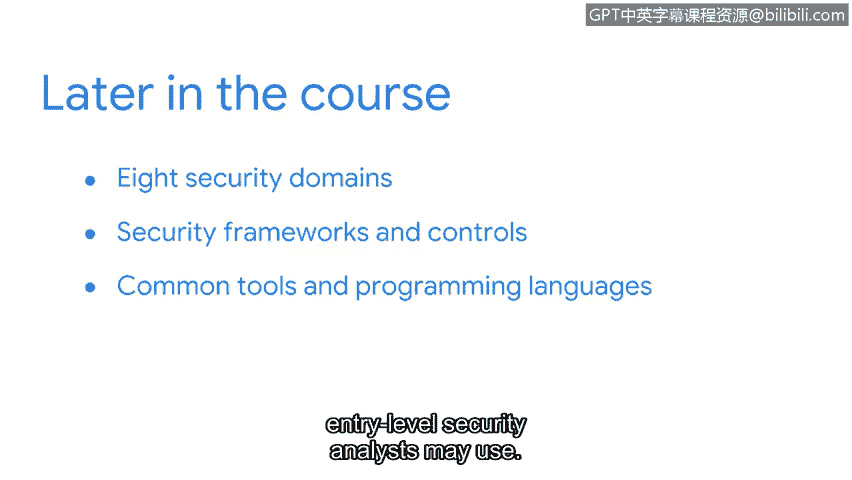

# 031：欢迎来到第一周

在本节课中，我们将要学习整个课程的概览以及第一周的具体学习内容。我们将介绍信息安全的基础概念、安全分析师的角色与技能，以及后续课程中将深入探讨的安全领域、框架和工具。

现在你已经对整个课程有了初步了解，接下来让我们更详细地讨论你将在本课程中学到什么。

本课程将向你介绍安全领域，以及如何利用安全知识来保护企业运营、用户和设备，从而为创建一个更安全的互联网环境贡献力量。

在接下来的部分，我们将涵盖基础的安全概念。首先，我们会定义什么是“安全”。

## 安全分析师的核心职责

上一节我们介绍了安全的基本定义，本节中我们来看看安全分析师常见的岗位职责。安全分析师负责监控和保护组织的网络与系统。

以下是安全分析师的一些核心工作内容：
*   监控网络以发现安全漏洞。
*   调查安全事件并做出响应。
*   实施和维护安全措施。
*   编写报告并记录安全流程。

## 安全分析师的核心技能

了解了职责之后，我们来看看胜任这些职责所需的核心技能。这些技能是安全分析师有效工作的基础。

以下是安全分析师应具备的一些关键技能：
*   **技术分析能力**：能够分析日志和识别异常模式。
*   **网络知识**：理解网络协议（如 **TCP/IP**）和架构。
*   **操作系统熟悉度**：精通如 **Linux** 和 **Windows** 等系统。
*   **沟通能力**：能够清晰地向技术及非技术人员传达安全风险。

## 安全的价值

掌握这些技能的目的是为了创造价值。接下来，我们将讨论安全对于保护组织和个人的重要性。安全是维护信任和业务连续性的基石。

## 后续课程内容预告

在课程的后半部分，我们将深入探讨八个关键的安全领域。

然后，我们将介绍常用的安全框架和控制措施。

最后，我们将通过讨论入门级安全分析师可能使用的常见工具和编程语言来结束本课程。

接下来，我们将介绍一些学习资源，帮助你从本课程中获得最大收益。

很高兴你能开启这段学习旅程。让我们开始吧。😊

---

本节课中我们一起学习了课程的总体介绍，明确了第一周将聚焦于信息安全基础概念、安全分析师的职责与技能，并预览了后续关于安全领域、框架和工具的课程内容。