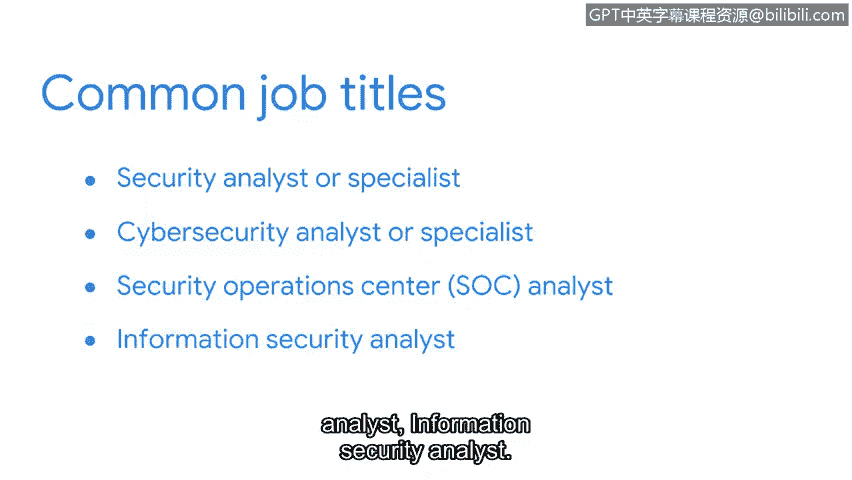

# 032：2_01_网络安全导论

在本节课中，我们将要学习网络安全的基本概念、安全团队的核心职责以及相关的职业角色。我们将通过一个生动的比喻来理解安全事件的处理过程。

想象你正在为一场风暴做准备。你收到了风暴即将来临的通知。你通过收集确保安全所需的工具和材料来进行准备。你确保门窗牢固。你准备了急救包、工具、食物和水。你已经准备就绪。风暴来袭，带来了强风和暴雨。风暴正试图利用其力量侵入你的家园。你注意到一些地方开始漏水，并迅速开始修补，以最小化任何风险或潜在的损害。

处理安全事件与此并无不同。组织必须为“风暴”做好准备，确保他们拥有减轻和快速应对外部威胁的工具。其目标是**最小化风险和潜在的损害**。作为一名安全分析师，你将致力于保护你的组织及其服务对象免受各种风险和外部威胁。如果威胁确实突破了防线，你和你的团队将提供解决方案来补救这种情况。

为了帮助你更好地理解这意味着什么，我们将定义安全，并讨论安全专业人员在组织中的角色。

## 定义网络安全 🔒

让我们从一些定义开始。**网络安全**或**安全**，是指通过保护网络、设备、人员和数据免受未经授权的访问或犯罪性利用，来确保信息的**机密性、完整性和可用性**的实践。

例如，要求使用复杂密码来访问网站和服务，通过使威胁行为者更难攻破它们，从而提高了**机密性**。**威胁行为者**是指任何构成安全风险的个人或团体。

## 安全团队的职责 🛡️

现在你知道了安全的定义，让我们来讨论安全团队为组织做什么。

**安全防护内外威胁**。**外部威胁**是指组织外部试图获取私有信息、网络或设备访问权的人。**内部威胁**则来自现任或前任员工、外部供应商或可信合作伙伴。通常，这些内部威胁是**意外**的，例如员工点击了电子邮件中的恶意链接。其他时候，内部人员会**故意**从事未经授权的数据访问或滥用系统谋取私利等活动。

经验丰富的安全专业人员将帮助组织**减轻或降低**此类威胁的影响。

**确保合规性**。安全团队还确保组织满足**法规遵从性**，即要求实施特定安全标准的法律和准则。确保组织合规可以使其避免罚款和审计，同时也履行了保护用户的道德义务。

**维持并提升业务生产力**。通过制定**业务连续性计划**，安全团队确保即使在发生数据泄露等事件时，人们也能继续工作。具备安全意识还可以降低与风险相关的费用，例如从数据丢失或运营停机中恢复，并可能避免罚款。

**维护品牌信任**。我们将讨论的最后一个安全益处是维护品牌信任。如果服务或客户数据遭到破坏，这会降低对组织的信任，损害品牌，并长期损害业务。客户信任的丧失也可能导致企业收入减少。

## 常见的网络安全角色 👨💻

现在，让我们了解一些常见的基于安全的角色。在完成此证书课程后，以下是一些你可能想要搜索的职位名称：

以下是本课程结束后你可能感兴趣的职位：
*   **安全分析师**或**安全专员**
*   **网络安全分析师**或**网络安全专员**
*   **安全运营中心分析师**
*   **信息安全分析师**

在本课程的后续部分，你还将了解更多与其中一些职位相关的职责。

## 总结 📝

本节课中我们一起学习了网络安全的核心定义，即保护信息的**CIA三要素（机密性、完整性、可用性）**。我们通过风暴的比喻理解了安全事件响应的准备与应对过程。我们还探讨了安全团队在组织中的四大核心职责：**防护威胁、确保合规、维持生产力、维护信任**。最后，我们介绍了完成本课程后可以从事的几个初级安全职位方向。

正如你现在可能意识到的，安全领域包含许多主题和概念。你在此课程中完成的每一项活动，都使你向一份新工作更近一步。让我们继续一起学习。