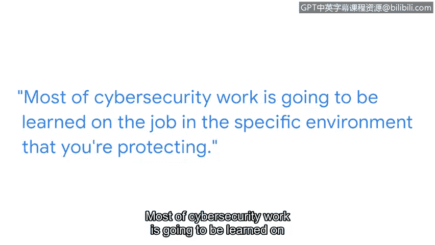

# 033：3_02_我的网络安全之路

在本节中，我们将跟随安全工程经理托尼的分享，了解他如何从国际关系领域转向网络安全，并探索非技术背景人员进入这一领域的路径与建议。

大家好，我是托尼，一名安全工程经理。我的团队负责保护谷歌及其用户免受严重威胁的侵害，这些威胁通常来自政府支持的攻击者、有组织的舆论影响行动以及严重的网络犯罪威胁行为者。

我从小在军人家庭长大，父亲是军人，因此我们经常搬家。我一直对广义上的安全领域抱有浓厚兴趣。高中时期，我对国际关系产生了极大的热情，参与了许多模拟联合国活动。这让我将世界范围内的安全运作方式与我的兴趣结合了起来。

我来自一个大家庭，深知自己需要经济援助才能上大学。美国国防部提供了许多与服役相关的教育机会，这对我来说是一个很自然的选择。我清楚自己对这个领域感兴趣，而这条路将为我热爱的职业提供一条途径。

我的职业生涯始于情报分析，但最初并未专注于网络安全。我从事了多年的反叛乱和地缘政治情报工作。最终，当我观察到网络安全开始对我们的日常生活以及国际关系领域产生影响时，我越来越被它所吸引。

对我来说，转向网络安全是一个巨大的转变。我进入这个领域时没有扎实的技术背景，必须通过工作实践和不同类型的自学课程来学习大量知识。我需要学习编程语言，例如 **Python** 和 **SQL**，这些也是本证书课程涵盖的内容。我还需要学习一门全新的“语言”，即关于威胁的词汇、不同组成部分以及它们如何在技术上体现。

在这段旅程的早期，我必须弄清楚的一件事是：我属于哪种类型的学习者。我最适合结构化的学习方式，因此我转向了许多在线课程和资源，这些材料从基本原理到实际应用，结构清晰，非常适合我。

很多知识也是在工作中向乐于分享并愿意花时间帮助我理解的同事们学习的。我提出了很多问题，现在依然如此。大部分的网络安全工作都需要在你所保护的具体环境中，通过实践来学习。

因此，为了能够构建知识库，你必须与团队成员良好协作。

我的建议是：保持好奇心，持续学习，尤其要专注于提升你的技术技能，并在整个职业生涯中不断发展它们。在网络安全领域，很容易产生“冒名顶替综合症”，因为这个领域太广泛了，精通所有这些不同领域需要一生的努力。有时，这种自我怀疑会让我们止步不前，觉得何必继续努力成长，反正永远无法精通，而不是激励我们前进。所以，请坚持学习，克服这种恐惧。你的努力终将获得回报。

在本节中，我们一起学习了托尼从国际关系转向网络安全的职业路径。他强调了结构化学习、在工作中向同事请教以及保持好奇心的重要性。对于初学者而言，即使没有技术背景，通过持续学习和实践，也能在网络安全领域找到自己的位置并取得成功。