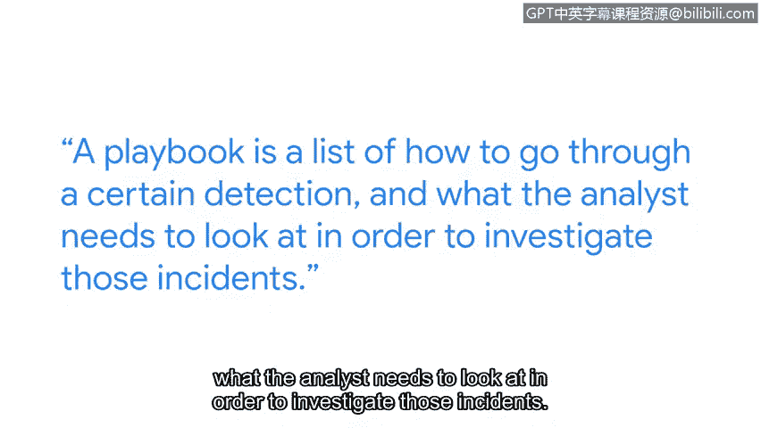

# 035：安全工程师的一天

## 概述

在本节课中，我们将跟随谷歌安全工程师Nikki的视角，了解一名初级网络安全专业人士的日常工作、职责分工以及所需的技能与心态。课程内容涵盖了安全工程师与分析师的角色区别、日常任务构成，以及如何在该领域起步并产生影响。

---

我的名字是Nikki，我是谷歌的一名安全工程师。

我隶属于谷歌的内部威胁检测团队，因此我的角色更侧重于发现公司内部的内部威胁或可疑活动。

我首次接触网络安全是在水族馆实习期间。我在那里学到了很多网络安全知识，当然，他们也面临许多网络钓鱼攻击尝试。在水族馆，我的经理非常注重确保我们的网络安全，我从他身上学到了很多，这真正激发了我对网络安全的兴趣。

我选择从事网络安全职业的主要原因是，一旦进入安全领域，职业发展路径非常灵活。你可以深入许多不同的领域，无论是通过蓝队（保护用户）还是红队（即寻找他人防御体系的漏洞并告知其问题所在）。

## 初级安全专业人员的一天

初级安全专业人员的一天可能日新月异，但基本由两部分构成。

一部分是运营侧工作，即响应检测警报并进行调查。另一部分是项目工作，即与其他团队合作构建新的检测机制或改进现有检测机制。

### 安全分析师与安全工程师的区别

初级网络安全分析师和初级网络安全工程师之间的区别主要在于：分析师更侧重于运营工作；而工程师虽然也能处理运营事务，但他们还负责构建检测机制，并从事更多以项目为核心的工作。

### 日常任务与挑战

我最喜欢的任务可能是运营侧的调查工作。因为有时我们会接到诸如“某行为人在某天做了某事”这样的警报，然后我们需要深入调查他们的行为、他们的工作内容，以判断是否存在可疑活动，或者这只是一次误报。

## 如何产生影响

作为一名初级网络安全专业人员，我产生影响的最大方式之一，实际上是完善我们团队使用的**操作手册**。

一个**操作手册**是一份清单，列出了如何处理特定检测警报，以及分析师需要查看哪些内容来进行调查。对于那些事件，我为自己目前编写的操作手册感到非常自豪，因为我的许多队友甚至都表示这些手册对他们非常有帮助。

## 总结与建议

本节课中，我们一起了解了安全工程师Nikki的日常工作，明确了安全运营与项目开发的双重职责，并认识了安全分析师与工程师的角色差异。关键在于，如果你热爱解决问题，热爱保护用户数据，并希望站在许多安全事件的前线，那么这绝对是一个适合你的角色。😊