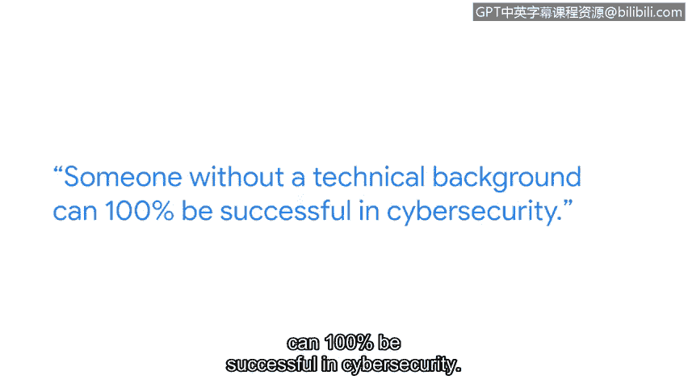

# 037：维罗妮卡的网络安全职业之路

## 概述
在本节中，我们将跟随谷歌安全工程师维罗妮卡的分享，了解她如何从非技术背景成功转型进入网络安全领域。她的经历将为初学者提供宝贵的职业路径参考。

## 正文

大家好，我是维罗妮卡，是谷歌的一名安全工程师。

我的网络安全职业旅程极大地改善了我的生活。其中最重要的部分是获得了有成就感的工作。我从事着自己非常热爱且超级感兴趣的事情，能以此为业我感到非常幸运。

在进入当前领域之前，我完全不了解网络安全是什么。我对网络安全的认知仅限于使用安全密码。所以，如果你在五年前问我是否会进入网络安全领域，我可能会反问“那是什么？”

没有技术背景的人完全可以在网络安全领域取得成功。我通往当前网络安全角色的道路始于在谷歌担任IT驻场工程师，负责技术支持。在那里，我学到了很多分析思维技能，例如故障排除和调试。

直到进入网络安全领域，我才意识到自己拥有可迁移的技能。

从那时起，我主动去请教了许多安全工程师，并采访了他们中的很多人。我能走到今天并非独自一人，而是得益于众多导师的帮助。所以，不要害怕寻求帮助。

我认为进入网络安全领域并不一定需要大学学位。我共事过的一些最聪明的人就没有大学学位。我认为这是这个行业最好的特点之一。

回顾我的职业生涯，我希望我当时能明白，我不需要满足所有条件才能去尝试，我也不需要成为某个领域的专家才去争取机会。

同时，我也希望我当时能明白，完美主义可能会阻碍你实现目标。

## 总结
本节课中，我们一起学习了维罗妮卡从非技术背景转型为网络安全工程师的经历。她的故事强调了**可迁移技能**、**主动学习**、**寻求导师帮助**以及**克服完美主义**的重要性。她的经历证明，成功进入网络安全领域的关键在于持续学习、勇于尝试和建立支持网络，而非特定的学历背景。