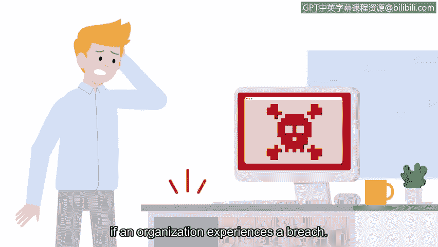

**谷歌网络安全专业证书：第一课：《信息安全基础》：P38：网络安全的重要性**

在本节课程中，我们将探讨网络安全为何至关重要。我们将了解数据泄露如何影响组织及其关联的个人，并学习个人身份信息（PII）和敏感个人身份信息（SPII）等核心概念，以及它们与身份盗窃风险的关系。

---

正如我们之前所讨论的，安全专业人员负责保护众多物理和数字资产。这些技能是组织和政府实体所渴求的，因为风险需要被管理。

接下来，我们继续探讨安全为何重要。安全对于确保组织的业务连续性和道德声誉至关重要。维护组织安全既涉及法律后果，也包含道德考量。

例如，一次数据泄露会影响与该组织相关的每一个人。这是因为数据丢失或泄露会损害组织的声誉，同时也会影响其用户、客户和顾客的生活与声誉。通过保持强有力的安全措施，组织可以增加用户信任。这可能会带来财务增长和持续的业务推荐。

如前所述，在数据泄露事件中，组织并非唯一的受害者。维护和保护用户、客户及供应商的数据，是防止可能暴露个人身份信息事件的重要环节。

**个人身份信息**，简称 **PII**，是指任何可用于推断个人身份的信息。**PII** 包括个人的全名、出生日期、物理地址、电话号码、电子邮件地址、互联网协议（IP）地址及类似信息。

**敏感个人身份信息**，简称 **SPII**，是 **PII** 的一种特定类型，遵循更严格的处理准则，可能包括社会安全号码、医疗或财务信息，以及面部识别等生物特征数据。如果 **SPII** 被盗，对个人造成的潜在损害可能远比 **PII** 被盗严重得多。

**PII** 和 **SPII** 数据是威胁行为者在组织遭遇泄露时寻找的关键资产。

---

当一个人的身份信息被泄露或盗取时，身份盗窃是首要担忧。**身份盗窃**是指窃取个人信息以冒充受害者进行欺诈的行为。身份盗窃的主要目的是获取经济利益。

---

我们已经探讨了安全至关重要的几个原因。雇主需要像您这样的安全分析师来满足当前及未来的需求，以保护数据、产品和人员，同时确保信息的机密性、完整性和安全访问。

这就是为什么美国劳工统计局预计，到2030年，对安全专业人员的需求将增长超过30%。

因此，请持续学习，最终您将能够为组织和人们创造一个更安全的环境贡献自己的力量。

---

**本节总结**

在本节中，我们一起学习了：
1.  网络安全对于组织业务连续性、声誉及法律合规性的重要性。
2.  **个人身份信息（PII）** 和 **敏感个人身份信息（SPII）** 的定义与区别。
3.  数据泄露如何导致**身份盗窃**，并对个人造成财务等损害。
4.  网络安全专业人员的角色是保护资产并确保信息安全的**机密性**、**完整性**和**可用性**，该领域正面临巨大的需求增长。