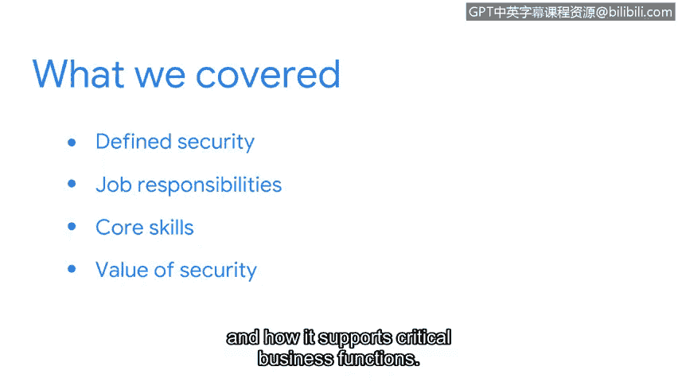

# 039：课程回顾与展望

在本节课中，我们将对课程第一部分的核心内容进行回顾，并展望接下来的学习方向。

## 课程回顾

恭喜你完成了本课程第一部分的全部内容。在进入下一阶段之前，让我们快速回顾一下目前所学的知识。

我们首先定义了**安全**的概念，并介绍了在组织中实施安全措施所带来的益处。随后，我们讨论了不同的工作职责，例如**管理威胁**和**安装防护软件**。我们还介绍了一些重要的核心技能，例如**团队协作**和**计算机取证**。最后，我们探讨了安全的价值，以及它如何支持关键的业务功能。

通过以上学习，希望你已对信息安全领域有了更深入的理解。如果你觉得在继续前进前需要重温某些内容，随时可以返回查看任何不确定的部分。

## 展望未来

掌握了这些基础知识，你正在为整个网络安全职业生涯打下坚实的基础。接下来，我们将探索一些塑造了安全行业的著名攻击案例。

我期待与你继续这段学习旅程。