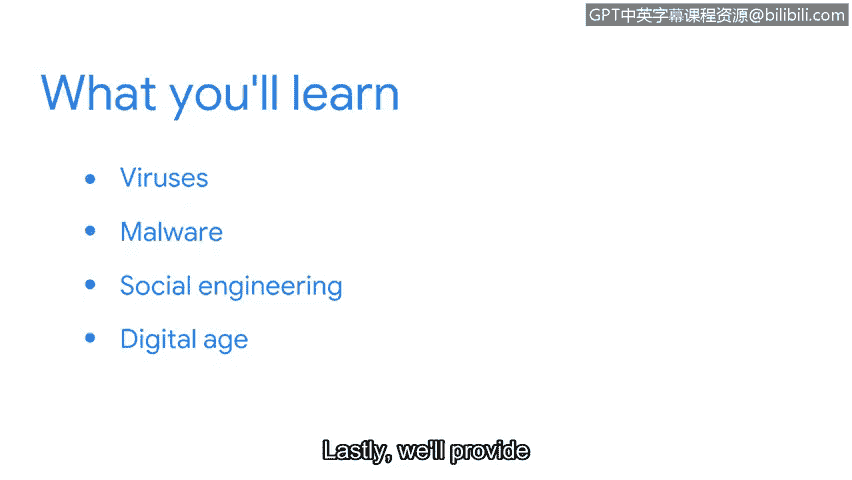
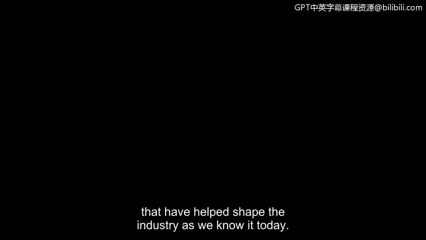

# 040：信息安全基础

## 概述

在本节课中，我们将学习网络安全领域的历史演变、核心威胁类型以及构成现代信息安全基础的八个关键领域。了解攻击的演变过程是防范未来威胁的关键。

欢迎回来。网络安全领域有大量知识需要学习，我很荣幸能成为你职业旅程的一部分。现在正是学习安全知识的激动人心的时刻。当我了解到影响私营公司和政府组织的国际黑客攻击时，我深受启发，希望投身于安全领域，因为我认识到这个领域是多么充满活力且重要。

如今安全领域存在如此多的工作岗位，其中一个原因便是20世纪80年代和90年代发生的攻击。数十年后，安全专业人员仍在积极工作，以保护组织和人们免受这些早期计算机攻击的各种变体威胁。在本节课程中，我们将讨论病毒和恶意软件，并介绍社会工程的概念。

接下来，我们将讨论数字时代如何开启了一个新的威胁行为者时代。了解每种攻击的演变过程是防范未来攻击的关键。最后，我们将概述八个安全域。

## 历史攻击回顾

上一节我们介绍了课程的整体框架，本节中我们来看看那些塑造了当今行业格局的历史性攻击。

接下来，我们将回溯时光，探索一些病毒、数据泄露和恶意软件攻击，正是它们帮助塑造了我们今天所知的行业。

## 总结

本节课中，我们一起学习了网络安全的重要性及其历史背景，探讨了病毒、恶意软件和社会工程等核心概念，并了解了从早期攻击到数字时代威胁的演变。最后，我们还预览了构成信息安全基础的八个关键领域，为后续深入学习奠定了基础。