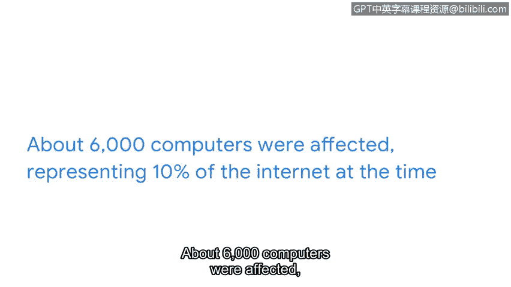

# 041：历史上的网络安全攻击

在本节中，我们将回顾历史上两个重要的网络安全攻击案例：Brain病毒和Morris蠕虫。理解这些早期攻击有助于我们认识安全行业的演变，并为当今的安全分析工作提供背景和方向。

## 概述

安全行业在不断演变，但当今的许多攻击方式并非完全创新。攻击者常常修改或增强以往的方法。了解过去的攻击，可以为安全分析师处理或调查事件提供指导。首先，我们来明确几个关键术语。

## 关键术语

以下是理解后续攻击案例所需的核心概念。

*   **计算机病毒**：指为干扰计算机操作、破坏数据和软件而编写的恶意代码。病毒会附着在计算机的程序或文档上，然后在网络中传播并感染一台或多台计算机。
*   **蠕虫**：指一种可以自行复制和传播的计算机病毒，无需人为干预。
*   **恶意软件**：当今，病毒更常被称为恶意软件，即专门设计用于危害设备或网络的软件。

## 早期恶意软件攻击案例

我们将要讨论的两个早期恶意软件攻击案例是Brain病毒和Morris蠕虫。它们由恶意软件开发者创建以完成特定任务，但开发者低估了其软件的影响范围和受感染计算机的数量。

接下来，让我们详细审视这些攻击，并探讨它们如何塑造了我们今天所知的安全格局。

### Brain病毒（1986年）

上一节我们定义了病毒，现在来看看它的一个早期实例。Brain病毒由阿尔维兄弟于1986年创建。虽然该病毒的初衷是追踪医疗软件的非法副本并防止盗版许可，但其实际行为却出乎意料。

一旦有人使用盗版软件，病毒就会感染该计算机。随后，任何插入该计算机的磁盘也会被感染。每当有人使用受感染的磁盘时，病毒就会传播到新的计算机。在未被察觉的情况下，该病毒在几个月内就传播到了全球。

尽管其意图并非破坏数据或硬件，但该病毒降低了生产效率，并对商业运营造成了重大影响。Brain病毒从根本上改变了计算行业，强调了制定计划以维护安全和生产力的必要性。作为一名安全分析师，你将遵循并维护既定的策略，以确保你的组织有保护其数据和人员安全的计划。

### Morris蠕虫（1988年）

另一个具有影响力的计算机攻击是Morris蠕虫。1988年，罗伯特·莫里斯开发了一个旨在评估互联网规模的程序。

该程序会在网络上爬行，并将自身安装到其他计算机上，以统计连接到互联网的计算机数量。听起来很简单，对吧？然而，该程序未能追踪它已经入侵过的计算机，并持续重新安装自身，直到计算机内存耗尽并崩溃。

大约6000台计算机受到影响，占当时互联网的10%。这次攻击因业务中断和清除蠕虫所需的努力，造成了数百万美元的损失。在Morris蠕虫事件之后，成立了计算机应急响应小组（CERTs），以应对计算机安全事件。

CERTs至今仍然存在，但它们在安全行业中的职责已经扩展到包含更多责任。在本课程的后续部分，你将了解更多关于这些安全团队的核心功能，并亲身体验检测和响应工具。

## 总结

本节课中，我们一起学习了早期网络安全攻击的历史案例。早期攻击在塑造当前安全行业方面发挥了关键作用。接下来，我们将讨论攻击在数字时代是如何演变的。