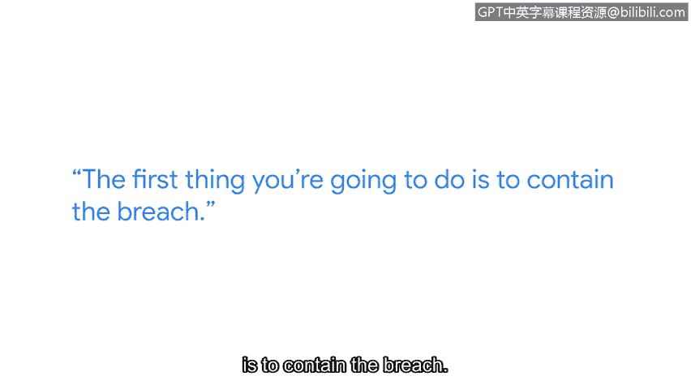

# 043：数据泄露中的冷静应对

在本节课中，我们将学习在应对数据泄露事件时，保持冷静和专业的重要性，并了解事件响应的核心步骤。

大家好，我是肖恩，是Google Workspace的一名技术项目经理。我是一名拥有30年经验的安全领域资深人士，曾在六个不同行业从事安全工作。

## 保持冷静的重要性

在首次经历数据泄露时，你能做的最重要的事情就是保持冷静。你周围的每个人可能都会惊慌失措。如果你是安全团队的一员，并且正在管理这起事件，你必须真正成为房间里最冷静的那个人。成为那个能在对话中保持停顿、掌控局面的人。

例如，有人可能会问：“你知道发生了什么吗？”你应该能够自信地回答：“我当然知道。”

## 一个真实的案例

我经历过最大的一次数据泄露事件，始于一个电话。另一家金融机构的一位工程师在eBay上购买了一台服务器。启动那台服务器后，发现它没有被擦除数据，里面存有**2000万条信用卡记录**。

这个事件引发了一次全面的审查。我们当时没有控制好如何与第三方处理数据，因为我们正在将数据中心外包。我们必须审视：**第三方应如何擦除我们不再使用的服务器**。

## 事件响应的核心步骤

上一节我们看到了一个因疏忽导致泄露的案例，本节中我们来看看事件发生后的标准应对流程。以下是事件响应的两个首要任务。

1.  **首要任务：遏制泄露**
    你要做的第一件事就是遏制泄露。如果数据仍在持续外泄，你必须按步骤采取措施来阻止数据流失。这意味着，如果需要关闭服务器、关闭数据中心或切断通信，那么阻止数据丢失就是你的第一要务。

2.  **核心职责：调查与处理**
    作为事件管理者或处理泄露的人员，你的职责是**先阻止泄露，再调查泄露**。因此，按计划执行你的事件管理流程，是初级人员最需要牢记于心的事情。

## 总结

本节课中我们一起学习了在数据泄露事件中保持冷静的关键作用，并通过一个真实案例了解了泄露可能源于意想不到的环节。我们明确了事件响应的核心流程：首要任务是**立即遏制数据外泄**，随后才是对事件进行调查。对于网络安全领域的初学者而言，牢记并执行既定的事件响应计划至关重要。