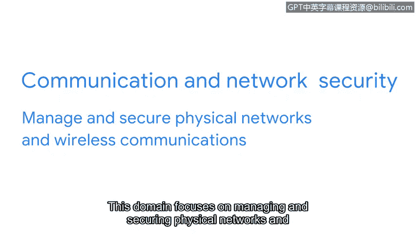

# 044：CISSP八大安全领域介绍（第一部分）

在本节课程中，我们将学习信息安全的核心基础概念。具体来说，我们会了解如何将这些概念归类到不同的安全领域中，并详细介绍其中前四个领域的内容、目标以及相关实例。

随着威胁行为者策略的演变，安全专业人员的角色也在不断发展。扎实理解核心安全概念将支持你在这个领域的成长。

更好地理解这些核心概念的一种方法，是将它们组织到称为安全领域的类别中。截至2022年，CISSP定义了八个领域来组织安全专业人员的工作。

理解这些领域相互关联非常重要，一个领域的缺陷可能导致整个组织遭受负面后果。理解这些领域也很重要，因为它可能帮助你更好地理解自己的职业目标以及在组织中的角色。当你了解更多关于每个领域的要素时，你可能会发现其中一个领域的工作比其他领域更吸引你。这个领域可能成为你进一步探索的职业道路。

CISSP总共定义了八个领域，我们将在本视频和下一个视频中讨论全部八个。在本视频中，我们将介绍前四个领域：安全与风险管理、资产安全、安全架构与工程、通信与网络安全。

让我们从第一个领域开始：安全与风险管理。

## 安全与风险管理 🎯

安全与风险管理侧重于定义安全目标和目的、风险缓解、合规性、业务连续性和法律。例如，如果联邦合规法规（如《健康保险携带和责任法案》，也称为HIPAA）发生变化，安全分析师可能需要更新公司关于私人健康信息的政策。

## 资产安全 💾

接下来我们看看第二个领域：资产安全。

此领域侧重于保护数字和物理资产。它还与数据的存储、维护、保留和销毁相关。在处理此领域时，安全分析师的任务可能是确保旧设备得到妥善处置和销毁，包括任何类型的机密信息。

## 安全架构与工程 🏗️

在了解了资产保护之后，第三个领域关注的是构建安全的系统。

此领域侧重于通过确保有效的工具、系统和流程到位来优化数据安全。作为安全分析师，你的任务可能是配置防火墙。防火墙是一种用于监控和过滤进出计算机网络流量的设备。正确设置防火墙有助于防止可能影响生产力的攻击。

## 通信与网络安全 📡

最后，我们来探讨确保信息传输安全的领域。

此领域侧重于管理和保护物理网络和无线通信。作为安全分析师，你可能会被要求分析组织内的用户行为。想象一下，发现用户正在连接到不安全的无线热点。这可能使组织及其员工容易受到攻击。为了确保通信安全，你将创建网络策略来防止和减轻暴露风险。

维护组织的安全是一项团队工作，涉及许多动态部分。作为入门级分析师，你将通过学习如何降低风险来保护人员和数据安全，从而持续发展你的技能。你不需要成为所有领域的专家，但对它们有基本的了解将有助于你作为安全专业人员的成长之旅。

你做得很好。我们刚刚介绍了前四个安全领域。在下一个视频中，我们将讨论另外四个领域。再见。

**本节课总结**：本节课我们一起学习了CISSP八大安全领域中的前四个。我们了解了**安全与风险管理**负责制定策略与合规，**资产安全**关注数据与设备的全生命周期保护，**安全架构与工程**致力于构建和优化安全的技术系统（如配置`防火墙`），而**通信与网络安全**则确保信息传输通道的安全。理解这些领域是构建全面网络安全知识体系的重要基础。