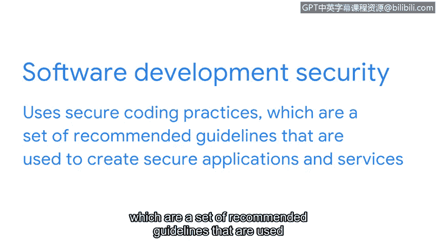

# 045：CISSP八大安全领域介绍（第二部分）

欢迎回来。在上一节视频中，我们介绍了前四个安全领域。在本节视频中，我们将介绍接下来的四个安全领域：身份与访问管理、安全评估与测试、安全运营以及软件开发安全。熟悉这些领域将帮助你驾驭复杂的安全世界。这些领域勾勒并组织了安全专业人员团队如何协同工作。

根据组织的不同，分析师的职位可能位于多个领域的交叉点，也可能专注于某一个特定领域。了解特定职位在安全版图中的位置，将有助于你为求职面试做好准备，并作为完整安全团队的一员开展工作。

接下来，让我们进入第五个领域。

## 身份与访问管理

身份与访问管理领域侧重于通过确保用户遵循既定策略来控制和管理物理资产（如办公场所）与逻辑资产（如网络和应用程序），从而保障数据安全。验证员工身份并记录访问角色对于维护组织的物理和数字安全至关重要。

例如，作为一名安全分析师，你的任务可能是设置员工的楼宇门禁卡权限。

上一节我们介绍了资产安全，本节我们来看看第六个领域。

## 安全评估与测试

该领域侧重于进行安全控制测试、收集和分析数据，以及执行安全审计以监控风险、威胁和漏洞。安全分析师可能会定期审计用户权限，以确保用户拥有正确的访问级别。

例如，薪资信息的访问权限通常仅限于特定员工，因此分析师可能会被要求定期审计权限，以确保未经授权的人员无法查看员工薪资。

了解如何评估风险后，我们进入第七个领域。

## 安全运营

该领域侧重于进行调查和实施预防措施。想象一下，你作为一名安全分析师，收到一个警报，显示有一个未知设备连接到了你的内部网络。你需要遵循组织的政策和程序，迅速阻止这一潜在威胁。

最后，我们来看第八个领域。

## 软件开发安全

该领域侧重于使用安全编码实践，这是一套用于创建安全应用程序和服务的推荐准则。

安全分析师可能会与软件开发团队合作，以确保安全实践被纳入软件开发生命周期。

例如，如果你的某个合作团队正在开发一个新的移动应用程序，那么你可能会被要求就密码策略提供建议，或确保任何用户数据都得到妥善的保护和管理。

以上便是对CISSP八大安全领域的介绍。挑战自己，以更好地理解这些领域中的每一个，以及它们如何影响组织的整体安全。尽管在课程的这个早期阶段，它们对你来说可能还有些模糊，但在下一门课程中，我们将对这些领域进行更详细的讨论。我们下节课再见。

---

**本节课总结**

在本节课中，我们一起学习了CISSP八大安全领域的后四个领域：**身份与访问管理**、**安全评估与测试**、**安全运营**以及**软件开发安全**。我们了解了每个领域的核心关注点及其在实际工作场景中的应用示例。掌握这些领域的基本概念，是构建全面网络安全知识体系的重要一步。