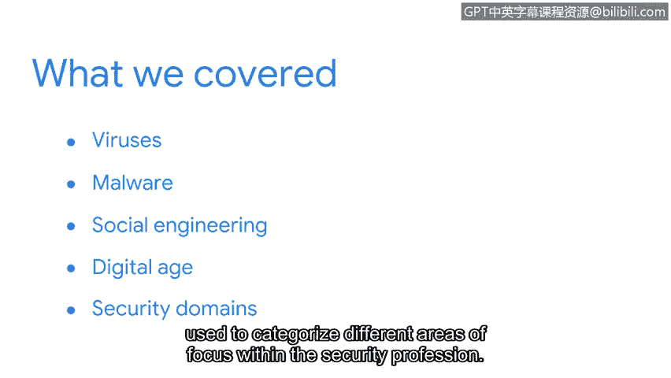

**网络安全基础：第一课：课程回顾与总结**

在本节课中，我们简要回顾了历史上一些最具影响力的安全攻击案例，并介绍了CISSP的八大安全域。现在，让我们总结一下所学内容。

上一节我们探讨了具体的攻击案例，本节中我们来整体回顾并理解其核心意义。

以下是本节课涵盖的核心内容：

*   **病毒与蠕虫**：我们介绍了**Brain病毒**和**Morris蠕虫**，讨论了这些早期恶意软件如何塑造了安全行业。许多现代攻击仍是这些早期案例的变种。理解历史攻击对于安全专业人员保护组织和人们免受未来可能的变体攻击至关重要。
*   **社会工程与攻击动机**：通过学习**“我爱你”病毒攻击**和**Equifax数据泄露事件**，我们讨论了社会工程和威胁行为者的动机。这些事件展示了数字时代近期安全漏洞的广泛影响及其相关代价。
*   **CISSP八大安全域**：我们引入了CISSP的八大安全域，并说明了如何利用它们来对安全专业内的不同重点领域进行分类。这为组织安全工作提供了一个框架。

---

我希望你对基础的网络安全知识已建立起信心。学习安全历史能帮助你更好地理解当前行业。CISSP的八大安全域提供了一种组织安全专业人员工作的方式。

请记住，每一位安全专业人员都至关重要。你独特的视角、专业背景和知识都具有宝贵价值。因此，当你致力于保护组织和人员安全时，你为这个领域带来的多样性将进一步推动安全行业的发展。

本节课中，我们一起学习了网络安全的历史案例、攻击者动机以及用于系统化安全知识体系的CISSP安全域框架。这些基础知识将为你后续的深入学习奠定坚实的起点。