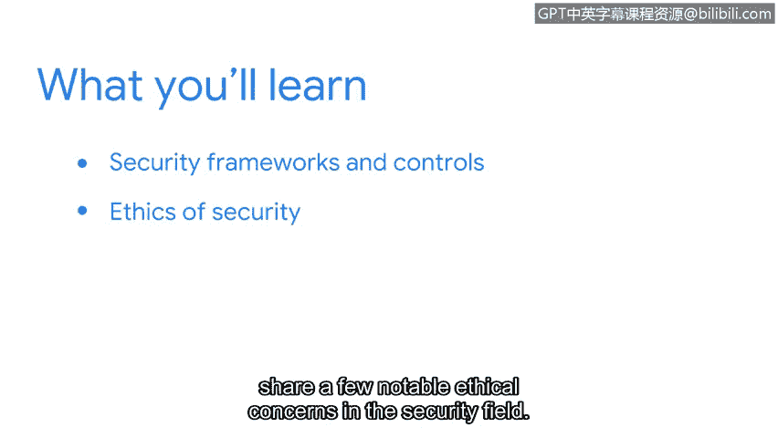

# 047：第3周课程介绍

## 概述

在本节课中，我们将学习组织如何通过框架、控制措施和道德准则等关键原则来保护自身免受威胁、风险和漏洞的侵害。这将帮助你更好地理解这些概念与安全分析师角色的关联。

## 课程内容

想象一下，你想要建造一个花园。你需要研究、规划、准备并购买材料，同时考虑所有可能对花园构成风险的因素。你制定计划来除草、喷洒杀虫剂并定期浇水，以预防问题或事件的发生。

然而，随着时间推移，意想不到的问题出现了。天气变得难以预测，害虫也试图侵入你的花园。

于是，你开始实施更好的方法来保护花园，例如安装监控摄像头、建造围栏、为植物搭建遮阳棚，以确保花园健康生长。

现在，你对花园面临的威胁以及如何保护植物有了更清晰的认识，你便可以建立更好的政策和流程，以持续监控和保护你的花园。

## 安全与花园的类比

通过这个类比，我们可以理解安全防护就像打理花园。这是一个不断发展的领域，它要求你持续改进政策和流程，以保护组织及其服务对象。

## 本周学习要点

以下是本周我们将要探讨的核心内容：

*   **安全框架与控制措施**：我们将介绍安全框架和控制措施，并解释它们的重要性。
*   **框架与控制措施的核心组件与实例**：我们将涵盖框架和控制措施的核心组件及具体例子，包括**保密性、完整性、可用性三要素**，即 **CIA Triad**。
*   **安全道德**：最后，我们将讨论安全道德，并分享安全领域中一些值得注意的道德问题。

## 安全实践的日常应用

不断发展的安全实践听起来可能有些抽象，但实际上我们很多人每天都在使用它们。

例如，我使用安全密钥（一种安全控制措施）作为访问账户的第二重身份验证形式。即使密码泄露，这些密钥也能确保只有我能访问我的账户。通过增强保密性，它们也保证了账户的完整性不受损害。

## 总结

本节课中，我们一起学习了安全防护如何通过持续的规划和改进来应对威胁，引入了安全框架、控制措施以及CIA三要素等核心概念，并了解了安全道德的重要性。对于任何组织而言，建立流程和程序来统筹安全工作和做出明智决策都至关重要。