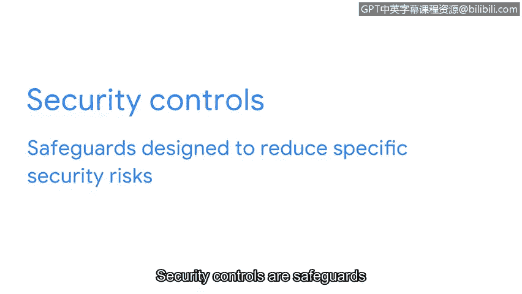

# 048：安全框架与控制入门

在本节课中，我们将要学习安全专业人员如何使用安全框架来持续识别和管理风险，以及如何使用安全控制来管理或降低特定风险。这些知识是构建有效安全防御体系的基础。

## 概述：什么是安全框架与控制？🛡️

想象一下，你作为一名安全分析师，收到了多个关于网络可疑活动的警报。你意识到需要实施额外的安全措施，以防止这些警报演变为严重的安全事件。那么，从哪里开始呢？作为分析师，你将从识别组织的关键资产和风险开始，然后实施必要的框架和控制措施。

上一节我们介绍了风险识别的重要性，本节中我们来看看如何通过系统化的框架和控制来应对这些风险。

## 安全框架详解 📋

安全框架是用于构建计划的指导方针，旨在帮助减轻对数据和隐私的风险与威胁。它们为实施安全生命周期提供了一个结构化的方法。

**安全生命周期**是一个不断发展的策略和标准集合，它定义了组织如何管理风险、遵循既定指南并满足法规遵从性或法律要求。

有多种安全框架可用于管理不同类型的组织和法规遵从性风险。安全框架的目的包括：
*   保护个人可识别信息。
*   保护财务信息。
*   识别安全弱点。
*   管理组织风险。
*   使安全目标与业务目标保持一致。

框架有四个核心组成部分，理解它们将使你能够更好地管理潜在风险。

以下是安全框架的四个核心组件：

1.  **识别并记录安全目标**。例如，一个组织的目标可能是遵循欧盟的《通用数据保护条例》（GDPR）。GDPR是一项数据保护法，旨在赋予欧洲公民对其个人数据的更多控制权。安全分析师可能需要识别并记录组织在哪些方面不符合GDPR要求。
2.  **设定实现安全目标的指导方针**。例如，在实施实现GDPR合规的指导方针时，你的组织可能需要制定新的政策来处理来自个人用户的数据请求。
3.  **实施强大的安全流程**。以GDPR为例，为社交媒体公司工作的安全分析师可能帮助设计程序，以确保组织遵守已验证的用户数据请求。此类请求的一个例子是用户尝试更新或删除其个人资料信息。
4.  **监控并沟通结果**。例如，你可能监控组织的内部网络，并向你的经理或法规遵从官报告可能影响GDPR的潜在安全问题。

现在我们已经介绍了安全框架的四个核心组件，让我们将它们整合起来。框架使分析师能够与安全团队的其他成员一起工作，记录、实施和使用已创建的政策和程序。对于初级分析师而言，理解这个过程至关重要，因为它直接影响他们的工作方式以及与他人的协作。

## 安全控制详解 ⚙️

接下来，我们将讨论安全控制。安全控制是旨在降低特定安全风险的防护措施。

例如，你的公司可能有一项指导方针，要求所有员工完成隐私培训，以降低数据泄露的风险。作为一名安全分析师，你可能使用软件工具来自动分配并跟踪哪些员工已完成此培训。

## 总结与展望 📈

安全框架和控制对于管理各类组织的安全至关重要，它们确保每个人都在为维持低风险水平而履行自己的职责。理解它们的目的和使用方法，使分析师能够支持组织的安全目标并保护其所服务的人员。

在接下来的视频中，我们将讨论一些分析师需要了解的知名框架和原则，以最大限度地降低风险并保护数据和用户。

本节课中我们一起学习了安全框架的四个核心组件（目标、指南、流程、监控）以及安全控制的作用。它们是构建系统性安全防御的基石，能帮助组织有条不紊地应对风险。