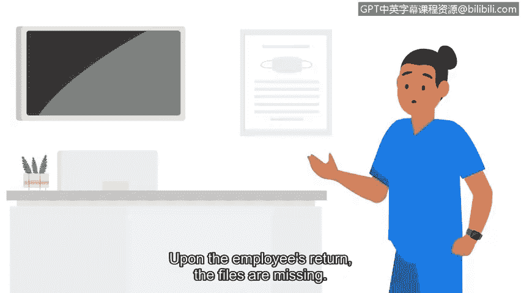

# 051：网络安全中的道德准则

在本节课中，我们将要学习网络安全领域中的道德准则。这些准则是安全专业人员做出正确决策的基石，尤其在面对复杂情况时，能帮助我们坚守原则，保护信息安全。

## 概述

在安全领域，新技术为每一个新的安全事件或风险带来了新的挑战。有时，判断决策的对错并非总是显而易见。作为安全专业人员，我们必须学会在伦理框架下思考和行动。

## 道德准则的核心原则

上一节我们介绍了网络安全中道德决策的重要性，本节中我们来看看三个核心的伦理原则。这些原则将指导我们在实际工作中处理敏感信息和应对风险。

以下是三个关键的网络伦理原则：

1.  **保密性**
    我们之前将保密性作为CIA三要素的一部分讨论过。现在，让我们探讨如何将保密性应用于道德层面。作为安全专业人员，你会接触到专有或私人信息，例如**PII**。你有道德责任对这些信息保密并确保其安全。例如，你可能想通过非正规渠道为同事提供计算机系统访问权限来提供帮助。然而，这种违反道德的行为可能导致严重后果，包括受到谴责、损害职业声誉，以及对你和你的朋友都造成法律后果。

2.  **隐私保护**
    隐私保护意味着保护个人信息免遭未经授权的使用。例如，假设你在下班后收到经理的私人邮件，索要一位同事的家庭电话号码。经理解释说目前无法访问员工数据库，但需要与该同事讨论紧急事务。作为安全分析师，你的职责是遵循公司的政策和程序。在此例中，公司政策规定员工信息存储在安全数据库中，绝不应以任何其他格式访问或共享。因此，访问和共享员工的个人信息是不道德的。在这种情况下，可能很难知道该怎么做。所以最好的回应是遵守组织制定的政策和程序。

3.  **法律**
    法律是被社会认可并由管理机构执行的规则。例如，考虑一名医院工作人员，他受过处理PII和SPII的培训以符合法规要求。该工作人员拥有不应无人看管的机密数据文件，但他开会迟到了。他没有将文件锁在指定区域，而是将文件无人看管地留在了办公桌上。等他回来时，文件不见了。这名工作人员刚刚违反了多项合规规定，他的行为是不道德且非法的，因为他的疏忽很可能导致了私人患者和医院数据的丢失。

## 总结与展望

本节课中我们一起学习了网络安全中的三大道德准则：保密性、隐私保护和遵守法律。这些原则是安全专业人员职业行为的指南针。

随着你进入安全领域，请记住技术在不断演变，攻击者的策略和技术也是如此。因此，安全专业人员必须持续批判性地思考如何应对攻击。拥有强烈的道德感可以指导你的决策，确保遵循正确的流程和程序，以减轻这些不断演变的风险。