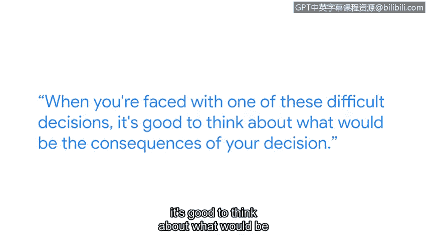
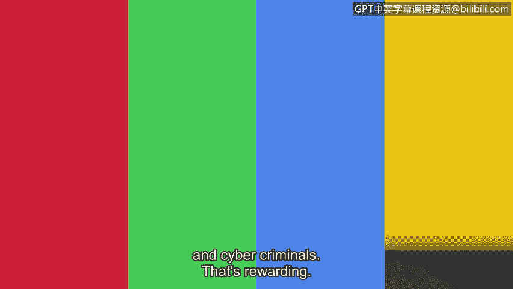

**谷歌网络安全专业证书课程：第一课：信息安全基础：P52：网络安全专业人员的职业道德重要性**

在本节课程中，我们将跟随谷歌云安全架构师Holly，探讨职业道德在网络安全领域的核心地位。我们将了解不道德行为的例子，学习如何应对工作中的道德困境，并认识到作为网络安全专业人员所肩负的责任与价值。

---

大家好，我是Holly，是谷歌云的一名云安全架构师。

在我职业生涯初期，我一边上学一边销售袜类产品。这份工作为我带来了进入银行业的机会。随后，我又从银行业进入了电信行业工作。

从那里开始，我设法进入了一家安全供应商公司，并开始学习安全知识。

我能够从技术生涯前半段的数据库管理员成功转型进入网络安全领域，部分原因在于我考取了相关证书，就像你们今天正在做的一样。

在我尚未拥有该领域经验时，这些证书确实帮助我在潜在雇主面前建立了可信度。

---

**职业道德是网络安全的核心**。要成为一名网络安全专业人员，你必须在所有行动中保持道德。

不道德行为的例子，通常源于人们的轻微惰性，他们走捷径，没有真正考虑自己行为的后果。

例如，当人们共享系统密码、泄露私人信息、或出于个人目的（无论是为了了解自己认识的人还是名人）而窥探系统时，这些都属于不道德行为。

在我的技术生涯中，遇到的最困难的道德困境之一发生在9/11事件后不久。我上司的上司的上司找到我，给了一串明显与纽约袭击事件相关的关键词，要求我查询我所管理的数据库——该数据库存储了整个电信公司所有用户的短信内容——而这一切没有任何书面授权，也没有法院命令。

我处于一个非常尴尬的境地，需要告诉一位比我资深得多的人，我对这样做感到不安。

我建议他提供书面文件给我，我再执行。最终，他找了其他人替他完成了这件事。

当你面临这类艰难抉择时，最好思考一下你的决定可能带来的后果。

---

对于正在学习本课程的你们，我想鼓励大家：帮助保护你的公司、用户或组织免受网络犯罪侵害所带来的回报是非常巨大的。

我们得以成为“好人”，帮助保护我们的行业和客户免受网络攻击和网络犯罪的侵害。这非常有意义。

---

**本节总结**

在本节中，我们一起学习了职业道德对于网络安全专业人员的根本重要性。我们了解到，保持道德操守是职业基石，不道德行为往往源于疏忽和走捷径。通过Holly分享的真实案例，我们认识到在面对道德困境时，需要勇气坚持原则，并权衡决策的后果。最后，我们明确了作为网络安全从业者，保护他人免受网络威胁是一项充满成就感的光荣使命。