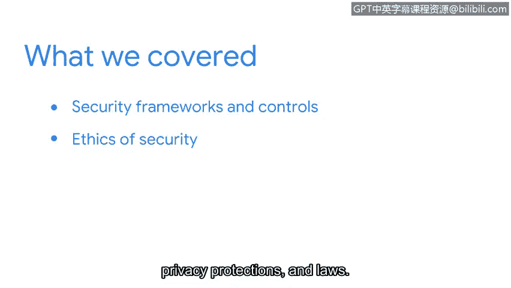

# 053：课程回顾与展望

在本节课中，我们将回顾已学习的关键信息安全概念，并展望后续课程中将接触的工具与技能。

## 课程回顾

上一节我们探讨了安全框架的具体应用，现在让我们总结本课程的核心内容。

我们讨论了**安全框架**和**安全控制措施**，以及如何利用它们来制定保护组织及其服务对象的流程与程序。

我们还探讨了框架的核心组成部分，例如：
*   识别安全目标。
*   制定实现这些目标的指导方针。

接着，我们介绍了具体的安全框架与控制模型，包括：
*   **CIA三元组**：这是一个核心安全模型，强调信息的**机密性**、**完整性**和**可用性**。
*   **NIST网络安全框架**：这是一个广泛使用的风险管理框架，帮助组织识别、保护、检测、响应和恢复网络安全事件。

最后，我们讨论了**安全伦理**，需要考虑的常见伦理问题包括：
*   保密性。
*   隐私保护及相关法律。

现在，您能更好地理解并协助进行风险评估与管理相关的决策。

## 后续展望

课程即将进入尾声，仅剩最后一个章节。

在接下来的部分中，您将学习安全分析师用于保护组织运营的常用工具和编程语言。

希望您能和我一样，对继续学习充满期待。

## 总结

本节课中，我们一起回顾了安全框架、控制措施、核心模型以及安全伦理，为理解信息安全基础画上了句号，并为学习实际安全分析工具做好了准备。