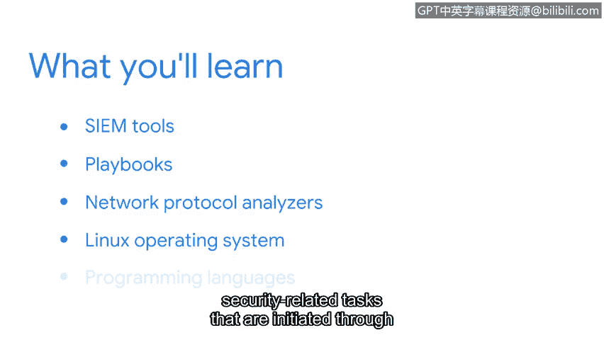

# 054：欢迎来到第四周

欢迎来到本课程的最后一个部分。在本节中，我们将介绍安全领域常用的工具和编程语言。

这些工具对于监控组织的安全至关重要，因为它们通过自动化任务来提高效率。

虽然我们目前只是介绍这些概念和工具，但在后续的课程项目中，你将有机会在各种实践活动中使用它们。

在接下来的视频中，你将学习安全信息和事件管理工具，即 **SIEM** 工具。

你还将接触到其他工具，例如剧本和网络协议分析器。

然后，你将了解 Linux 操作系统，以及通过 **SQL** 和 **Python** 等编程语言启动的与安全相关的任务。

对我来说，**SQL** 是最有用的工具之一。它允许我探索我们收集的所有不同数据源，并让我的团队能够分析数据趋势。

请花时间仔细观看视频，如有需要，可以重新观看。同时要了解，这些工具将在证书课程后续内容中进行更详细的讨论，并且你将能够亲手实践。

虽然每个组织都有自己的一套工具和培训材料，你将在工作中学习使用它们，但本课程将为你提供基础知识，帮助你在安全行业取得成功。

让我们开始吧。