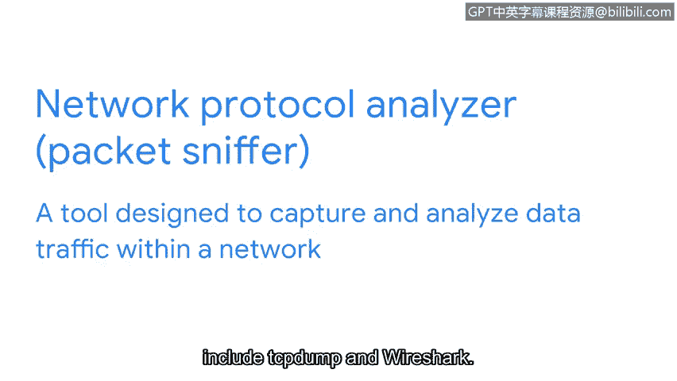

# 055：常见网络安全工具

## 概述

在本节课程中，我们将学习网络安全分析师常用的几种核心工具。我们将了解这些工具的主要目的和功能，并初步认识它们如何帮助组织识别和降低安全风险。

## 日志：安全工具的数据基础

在深入讨论工具之前，我们先简要了解一下日志。日志是安全工具需要组织和分析的数据来源。**日志**是记录组织系统内发生事件的文档。与安全相关的日志示例包括员工登录计算机或访问基于网络服务的记录。日志帮助安全专业人员识别漏洞和潜在的安全漏洞。

## 安全信息与事件管理工具

上一节我们介绍了日志，本节中我们来看看用于分析日志的核心工具：安全信息与事件管理工具。

**安全信息与事件管理工具**是一种收集和分析日志数据以监控组织关键活动的应用程序。其英文缩写为 SIEM，在本课程中我们统一读作 “SIim”。

SIim 工具收集实时或即时信息，使安全分析师能够在安全事件发生时识别潜在的入侵。想象一下，为了确定是否存在安全威胁，需要阅读一页又一页的日志。根据数据量的不同，这可能需要数小时甚至数天。SIim 工具通过为特定类型的风险和威胁提供警报，减少了分析师必须审查的数据量。

以下是两种常用的 SIim 工具示例：

*   **Splunk**：Splunk 是一个数据分析平台。Splunk Enterprise 提供了 SIEM 解决方案，它是一个自托管工具，用于保留、分析和搜索组织的日志数据。
*   **Chronicle**：Chronicle 是谷歌的云原生 SIEM 工具，用于存储安全数据以供搜索和分析。云原生意味着 Chronicle 能够快速交付新功能。

这两种 SIEM 工具，以及所有 SIEM 工具，都从多个来源收集数据，然后分析和过滤这些数据，使安全团队能够预防并快速应对潜在的安全威胁。

作为安全分析师，您可能会使用 SIim 工具来分析过滤后的事件和模式、执行事件分析或主动搜索威胁。根据您组织的 SIEM 设置和风险关注点，工具及其功能可能有所不同，但最终它们都用于降低风险。

## 其他关键安全工具

除了 SIEM 工具，安全分析师角色中还会用到其他关键工具，本课程后续也将提供实践机会。

**剧本**是提供任何操作行动细节的手册，例如如何响应事件。剧本因组织而异，指导分析师在安全事件发生前、发生期间和发生后如何处理。剧本可以涉及安全或合规性审查、访问管理以及许多其他需要从头到尾记录流程的组织任务。

另一个您可能用到的工具是**网络协议分析器**，也称为**数据包嗅探器**。数据包嗅探器是一种旨在捕获和分析网络内数据流量的工具。常见的网络协议分析器包括 TCPDump 和 Wireshark。

## 总结

本节课中，我们一起学习了网络安全分析师常用的几种工具。我们了解了日志是安全分析的基础数据源，认识了用于集中监控和分析日志的 SIEM 工具，并简要介绍了指导标准化响应的剧本和分析网络流量的协议分析器。作为初级分析师，您无需立即成为这些工具的专家。随着您在本证书课程中继续学习并获得更多实践，您将不断加深对如何使用这些工具来识别、评估和降低风险的理解。

