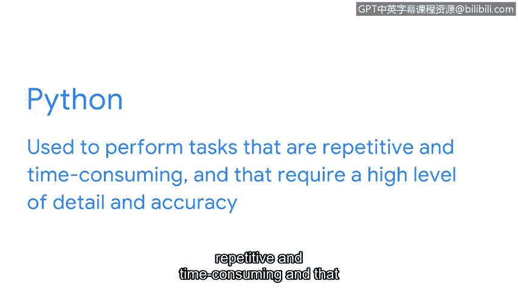

# 056：Linux、SQL与Python简介

在本节课程中，我们将学习网络安全分析师工具箱中的另外几项关键工具：Linux操作系统以及SQL和Python编程语言。我们将了解它们的基本概念、用途以及为何它们对安全分析工作至关重要。

## 概述：编程与操作系统在安全分析中的角色

正如我们之前所讨论的，组织使用多种工具（如SIEM、预案和包嗅探器）来更好地管理、监控和分析安全威胁。然而，这些并非分析师工具箱中的全部。分析师还使用编程语言和操作系统来完成核心任务。

编程允许分析师为计算机创建一套特定的指令来执行任务。它能以极高的准确性和效率完成重复性任务和流程，有助于降低人为错误的风险，并且相比手动操作可以节省数小时甚至数天的时间。

了解了编程语言的用途后，接下来让我们讨论一个特定的操作系统——Linux，以及两种编程语言——SQL和Python。

## Linux：开源的操作系统

Linux是一个开源（即公开可用）的操作系统。与您可能熟悉的其他操作系统（例如macOS或Windows）不同，Linux主要依赖命令行作为用户界面。

Linux本身不是一种编程语言，但它允许用户和操作系统之间使用基于文本的命令进行交互。在本证书课程的后续部分，您将更深入地学习Linux。

对于初级安全分析师而言，Linux的一个常见用途是检查日志，以更好地理解系统中正在发生的情况。例如，在调查异常高的网络流量时，您可能会使用命令来审查错误日志。

## SQL：与数据库交互的语言

接下来我们讨论SQL。SQL代表**结构化查询语言**。它是一种用于创建、与数据库交互以及从数据库请求信息的编程语言。

数据库是信息或数据的有组织集合。一个数据库中可能包含数百万个数据点。因此，初级安全分析师会使用SQL来筛选这些数据点，以检索特定信息。

## Python：自动化与精确任务处理

我们将介绍的最后一个编程语言是Python。安全专业人员可以使用Python来执行那些重复、耗时且需要高度细节和准确性的任务。

## 总结：工具的选择与学习价值

作为一名未来的分析师，重要的是要理解，每个组织的工具包可能因其安全需求而有所不同。关键在于熟悉一些行业标准工具，因为这将向雇主展示您有能力学习如何使用他们的工具来保护组织及其服务的人群。

您学得很棒。在本课程的后续部分，您将更深入地了解Linux和编程语言，并有机会在安全相关的场景中练习使用这些工具。

