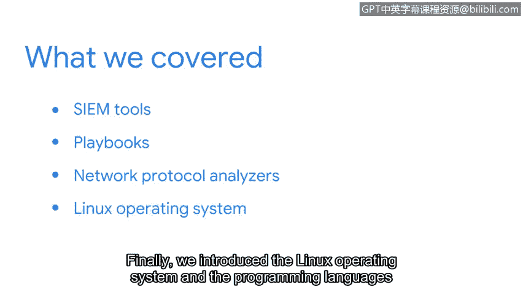

# 057：安全工具与编程语言总结 🛠️💻

在本节课中，我们将回顾并总结在安全工具与编程语言入门部分所涵盖的核心内容。我们将了解安全分析师使用的关键工具，并初步认识几种重要的编程语言。

上一节我们介绍了多种安全工具，本节中我们来看看对这些内容的总结。

## 工具回顾

我们首先介绍了SIEM工具，例如Splunk和Chronicle。这些工具用于收集和分析来自整个组织网络的数据，以识别潜在的安全威胁。

以下是SIEM工具的主要用途：
*   安全分析师使用SIEM工具来完成不同的任务。
*   这些任务包括日志聚合、事件关联分析和生成安全警报。

接着，我们讨论了其他类型的工具。

以下是本课程涉及的其他关键工具：
*   **剧本**：用于标准化事件响应流程的预定义步骤指南。
*   **网络协议分析器**（也称为数据包嗅探器）：用于捕获和检查网络流量数据包的工具。

## 编程语言与操作系统

最后，我们引入了Linux操作系统以及SQL和Python这两种编程语言。

以下是它们的基本介绍：
*   **Linux操作系统**：一种在服务器和安全领域广泛使用的开源操作系统。
*   **SQL**：一种用于管理和查询数据库的编程语言。
*   **Python**：一种功能强大且易于学习的通用编程语言，常用于自动化任务和安全脚本编写。

## 重要提示

请记住，我们讨论的这些工具需要时间才能完全掌握。然而，对这些工具有一个基本的理解，可以帮助你获得安全领域的工作并在职业生涯中取得进步。

本节课中我们一起学习了SIEM工具、剧本、网络协议分析器等安全工具，并初步认识了Linux操作系统以及SQL和Python编程语言。对这些基础知识的掌握是迈向网络安全职业生涯的重要第一步。