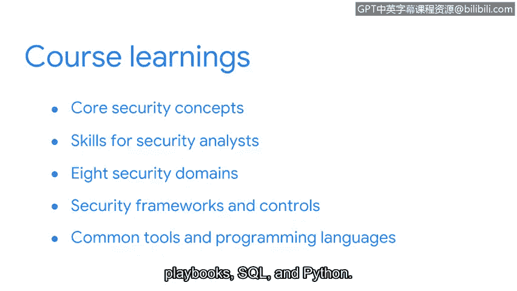

# 058：课程总结

在本节课中，我们将对第一门课程的核心内容进行回顾与总结，梳理已学习的关键概念与技能。

---

恭喜你完成第一门课程。我们已经走过了很长的路，并涵盖了这个激动人心行业的众多内容。

😊 我认为网络安全令人兴奋，因为它充满活力，总有新的难题需要解决，并且保护用户的工作非常有价值。

在继续前进之前，让我们花点时间来庆祝并回顾一下我们所学的内容。

以下是我们在本课程中涵盖的主要模块：

*   **核心安全概念**：我们介绍了安全是什么及其重要性，讨论了初级安全分析师的工作职责，以及与该角色相关的一些技能。
*   **八大安全领域**：我们过渡到八大安全领域的学习，其中包括安全与风险管理、资产安全以及安全运营等。
*   **安全框架与控制**：我们重点介绍了安全框架与控制措施，特别是**CIA三元组模型**（保密性、完整性、可用性）和**NIST网络安全框架**。
*   **常用工具与编程语言**：我们探索了安全分析师常用的工具和编程语言，例如**SIEM系统**、**应急预案**、**SQL**和**Python**。

😊

---

我希望你为迄今为止所做的工作感到自豪。

无论你在安全行业选择哪个方向，你现在所学的一切都为职业生涯的下一阶段奠定了坚实的基础。

随着你在这个项目中的深入，你将有机会进一步发展你的技能。

在下一门课程中，我们将对本课程中介绍的几个主题提供更详细的讲解。

大家好，我是Ashley，我将引导大家完成证书项目的下一门课程。我们将更详细地讨论安全领域和业务运营。😊

---

我很高兴能陪伴你开启这段旅程。你已经有了一个良好的开端，我期待着你实现加入安全行业的目标。😊

---

本节课中，我们一起回顾了信息安全的核心概念、关键领域、重要框架以及基础工具。这些知识构成了网络安全领域的基石，为你后续的深入学习打下了坚实的基础。