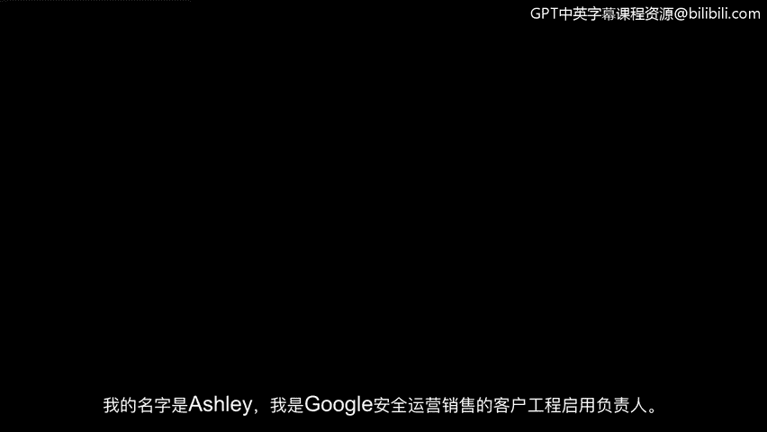
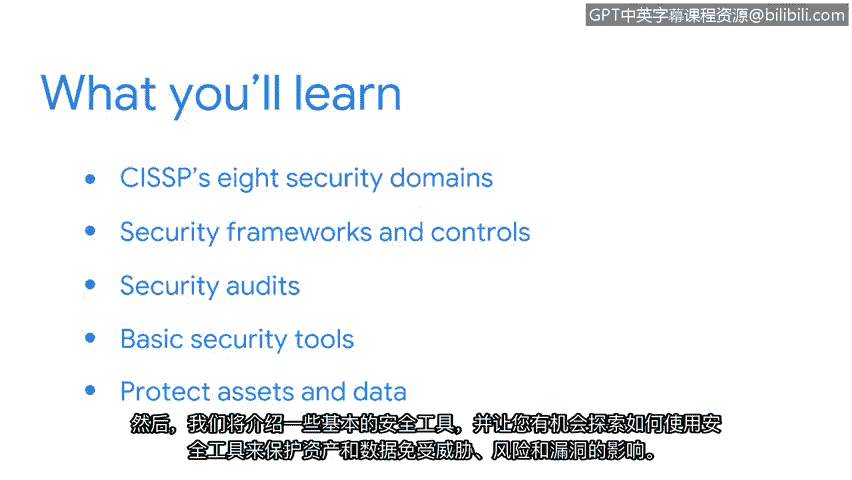

# 001：课程介绍

在本节课中，我们将要学习《安全风险管理》课程的整体框架与核心目标。我们将回顾已学知识，并预览本课程将深入探讨的关键主题，包括安全域、框架、控制、审计以及基础安全工具。

## 课程回顾与展望

上一节我们介绍了网络安全的基础概念与入门级分析师的核心职责。本节中，我们来看看本课程的具体学习路径。

我的名字是阿什莉，我是谷歌安全运营销售部门的客户工程赋能负责人。我很荣幸能担任本课程的讲师。

让我们先快速回顾一下目前已经涵盖的内容。此前，我们定义了安全的概念，并探讨了入门级分析师的一些常见工作职责。我们也讨论了分析师需要培养的核心技能与知识。接着，我们分享了一些关键事件，例如“爱虫”病毒和莫里斯蠕虫攻击，这些事件推动了安全领域的发展与持续演进。我们还向您介绍了用于降低风险的框架、控制措施和CIA三要素（**机密性、完整性、可用性**）。

在本课程中，我们将讨论注册信息系统安全专家所关注的八个安全域。我们还将更详细地介绍安全框架与控制措施，重点是美国国家标准与技术研究院的风险管理框架。此外，我们将探讨安全审计，包括内部审计的常见要素。之后，我们将介绍一些基础的安全工具，您将有机会探索如何使用安全工具来保护资产和数据免受威胁、风险和漏洞的影响。

## 保护组织安全的重要性

保护组织及其资产免受威胁、风险和漏洞的影响，是维持业务运营的重要步骤。根据我作为安全分析师的经验，我曾协助应对一次严重的违规事件，该事件给组织造成了近25万美元的损失。因此，我希望您能保持动力，继续您的安全学习之旅。我知道我已充满期待。

让我们开始吧。

## 总结

本节课中，我们一起学习了《安全风险管理》课程的概述。我们回顾了安全基础、CIA三要素等前期知识，并明确了本课程将深入学习的核心内容：安全域、NIST风险管理框架、安全审计以及基础工具的应用。这些知识将为我们后续构建系统的安全风险管理能力打下坚实基础。