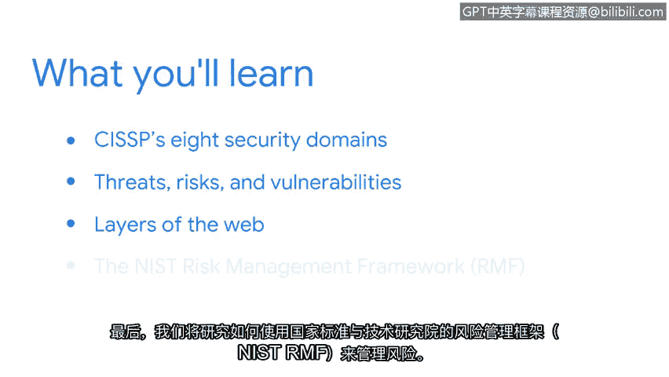

# 002：欢迎来到第一周 🛡️

在本节课中，我们将学习网络安全的基础知识，包括CISSP的八个安全域、威胁、风险与漏洞的概念、网络的三层结构，以及如何使用NIST风险管理框架来管理风险。这些内容是安全领域的核心知识，掌握它们将帮助你理解和应对组织日常面临的安全挑战。

## 理解安全领域与核心概念

网络安全的世界非常广阔。确保你拥有成功驾驭这个世界所需的知识、技能和工具，正是我们学习本课程的目的。

在接下来的视频中，你将了解CISSP八个安全域的重点内容。

## 深入探讨威胁、风险与漏洞

上一节我们介绍了安全领域的概况，本节中我们来看看更具体的安全要素。我们将更详细地讨论威胁、风险和漏洞。

我们还将向你介绍网络的三层结构，并分享一些示例，以帮助你理解在本课程中将讨论的不同类型的攻击。

## 风险管理框架

最后，我们将研究如何通过使用美国国家标准与技术研究院的风险管理框架来管理风险，该框架被称为 **NIST RMF**。

因为这些主题及相关技术技能被视为安全领域的核心知识，持续加深对它们的理解，将帮助你缓解和管理组织日常面临的风险与威胁。

## 总结与预告

本节课中，我们一起学习了网络安全的基础框架、核心概念以及NIST风险管理框架。在下一个视频中，我们将进一步讨论在第一门课程中介绍的八个安全域的重点内容。