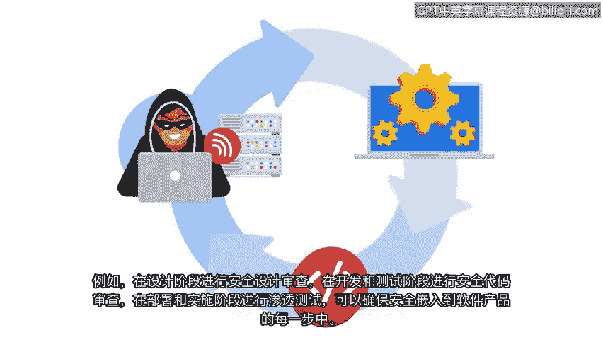

# 004：探索CISSP安全领域（下）🔐

在本节课程中，我们将继续学习CISSP的八个安全领域，重点介绍身份与访问管理、安全评估与测试、安全运营以及软件开发安全这四个领域。理解这些领域对于构建全面的安全知识体系至关重要。

上一节我们介绍了前四个安全领域，本节中我们来看看剩下的四个领域。

## 身份与访问管理 👤

身份与访问管理（IAM）专注于通过确保用户遵循既定策略来控制和访问资产，从而保障数据安全。其核心目标是降低系统和数据的整体风险。

IAM包含四个主要组成部分：
*   **身份识别**：用户通过提供用户名、门禁卡或指纹等生物特征数据来声明其身份。
*   **身份验证**：验证用户身份的过程，例如输入密码或PIN码。
*   **授权**：在用户身份确认后，根据其在组织中的角色，确定其访问权限级别。
*   **可问责性**：监控和记录用户行为（如登录尝试），以证明系统和数据被正当使用。

## 安全评估与测试 🧪

安全评估与测试领域侧重于进行安全控制测试、收集分析数据以及执行安全审计，以监控风险、威胁和漏洞。

以下是该领域的核心活动：
*   **安全控制测试**：帮助组织识别缓解威胁、风险和漏洞的新方法及改进措施。
*   **数据收集与分析**：定期进行有助于预防组织面临的威胁和风险。
*   **报告与改进**：分析师利用评估和报告来改进现有控制措施或实施新的控制措施，例如引入多因素认证。

## 安全运营 🛡️

安全运营领域侧重于进行调查和实施预防措施。调查在安全事件被识别后立即开始，需要高度紧迫感以最小化对组织的潜在风险。

安全运营的关键步骤包括：
1.  **事件响应**：若存在主动攻击，缓解攻击并防止其升级对保护私有信息至关重要。
2.  **证据收集**：威胁被消除后，开始收集数字和物理证据以进行取证调查。
3.  **取证调查**：必须进行数字取证调查，以确定入侵发生的时间、方式和原因。
4.  **改进预防**：这有助于安全团队确定需要改进的领域以及可采取的预防措施，以减轻未来的攻击。

## 软件开发安全 💻

软件开发安全领域专注于使用安全编码实践。安全编码实践是用于创建安全应用程序和服务的推荐指南。

将安全集成到软件开发生命周期（SDLC）中至关重要。SDLC是团队用于快速构建软件产品和功能的高效流程，安全应作为其中的一个附加步骤。

通过在SDLC的每个阶段进行安全审查，可以将安全完全集成到软件产品中。例如：
*   **设计阶段**：执行安全设计评审。
*   **开发与测试阶段**：执行安全代码评审。
*   **部署与实施阶段**：进行渗透测试。

这种方法确保安全在每一步都嵌入到软件产品中，从而保护软件安全、保护敏感数据并减轻组织的不必要风险。

熟悉这些领域可以帮助您更好地理解它们如何用于提升组织的整体安全，以及安全团队所扮演的关键角色。

本节课中我们一起学习了CISSP的剩余四个安全领域：身份与访问管理、安全评估与测试、安全运营以及软件开发安全。每个领域都提供了保护组织资产和数据的特定框架与方法。